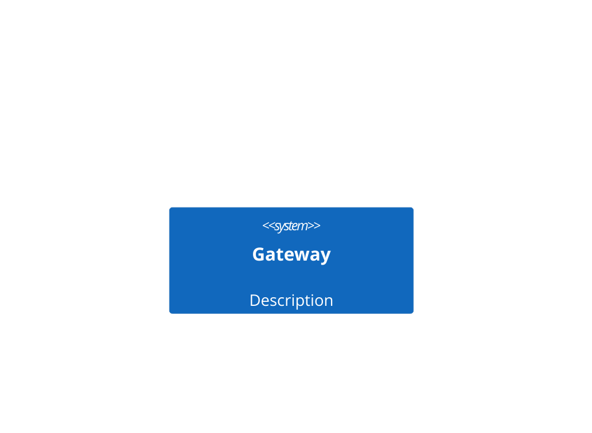
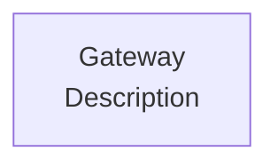
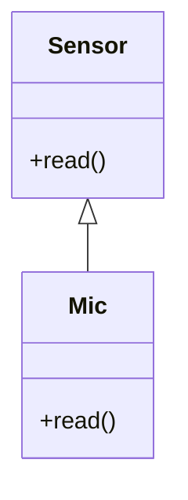
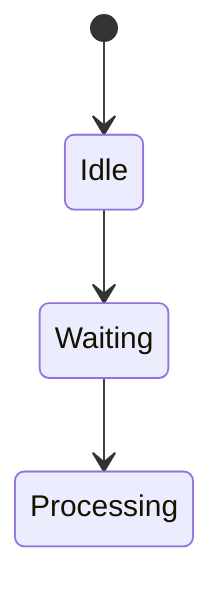
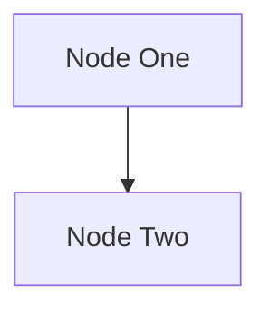
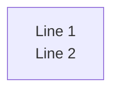
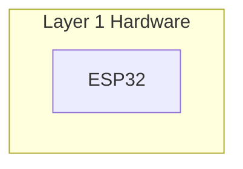
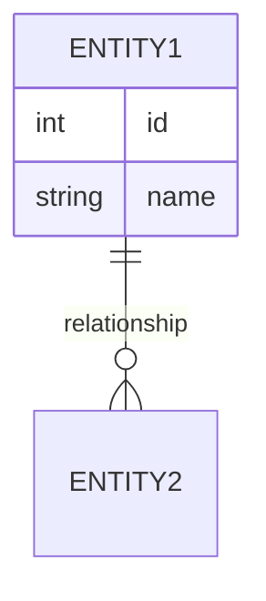

# Mermaid Syntax Rules for thought-bubble Visualisation
## Lessons Learned from Debugging Session

**Date:** 21 January 2026  
**Context:** Generating interactive HTML visualisations with 12+ Mermaid diagrams  
**Outcome:** All diagrams rendering successfully after systematic debugging

---

## Critical Rules (MUST Follow)

### 1. Node ID Uniqueness Across ALL Diagrams
**Problem:** Reusing node IDs (like `Node1`, `Gateway`) across multiple diagrams causes NaN positioning errors.

**Solution:** Prefix ALL node IDs per diagram:
```mermaid
# Diagram 1 (Workflow)
WF1User[User] --> WF1GW[Gateway]

# Diagram 2 (Architecture) 
SYS1User[User] --> SYS1GW[Gateway]

# Diagram 3 (Data Model)
D1Node[Node] --> D1Cache[Cache]
```

**Rule:** Use unique prefixes like `WF1`, `SYS1`, `D1`, `R1` etc. for each diagram.

---

### 2. NO Special Characters in Labels
**Problem:** Characters like `<`, `>`, `:`, `→`, `↔` break Mermaid parsing.

**Forbidden:**
- `Layer < 22?` ❌
- `Layer 1: Hardware` ❌
- `State → Next` ❌
- `A <--> B` in labels ❌

**Use Instead:**
- `Layer under 22?` ✅
- `Layer 1 Hardware` ✅
- `State to Next` ✅
- Plain ASCII text only ✅

**Rule:** Labels must be plain ASCII alphanumeric + spaces only.

---

### 3. Container Element Must Be `<pre>`
**Problem:** Using `<div class="mermaid">` can cause rendering issues.

**Correct:**
```html
<pre class="mermaid">
flowchart TD
    A --> B
</pre>
```

**Incorrect:**
```html
<div class="mermaid">
flowchart TD
    A --> B
</div>
```

**Rule:** Always use `<pre class="mermaid">` for diagram containers.

---

### 4. Zero Indentation for Mermaid Code
**Problem:** Indented Mermaid code inside `<pre>` tags breaks parsing.

**Correct:**
```html
<pre class="mermaid">
flowchart TD
    A --> B
</pre>
```

**Incorrect:**
```html
<pre class="mermaid">
    flowchart TD        <!-- Extra indentation -->
        A --> B
</pre>
```

**Rule:** Mermaid syntax must start at column 0 inside `<pre>` tags.

---

### 5. Avoid C4 Diagram Syntax
**Problem:** C4Context, C4Component, C4Container require plugins not in standard Mermaid.

**Not Supported:**


**Use Instead:**


**Rule:** Use standard `graph` or `flowchart` instead of C4 syntax.

---

### 6. Simplified Class Diagram Syntax
**Problem:** Keywords like `<<interface>>`, generic types, complex notation fail.

**Avoid:**
- `<<interface>>` ❌
- `List<String>` or `float[2048]` ❌
- `~protected` visibility ❌

**Use:**


**Rule:** Keep class diagrams minimal - simple inheritance and basic methods only.

---

### 7. State Diagram Naming
**Problem:** Prefixed state names (like `R3Idle`) can cause label positioning errors.

**Use Plain Names:**


**Not:**
```mermaid
stateDiagram-v2
    [*] --> R3Idle    <!-- Prefix causes issues -->
    R3Idle --> R3Wait
```

**Rule:** State diagrams should use simple, unprefixed state names.

---

### 8. Line Break Handling
**Problem:** Using `<br/>` (XML-style) vs `<br>` (HTML-style) can be inconsistent.

**Safe Approach:**


**For Multi-line (use sparingly):**


**Rule:** Avoid multi-line labels where possible. If needed, use `<br>` not `<br/>`.

---

### 9. Subgraph Label Restrictions
**Problem:** Colons in subgraph labels break parsing.

**Correct:**


**Incorrect:**
```mermaid
flowchart TB
    subgraph L1[Layer 1: Hardware]  <!-- Colon breaks it -->
        HW1[ESP32]
    end
```

**Rule:** No colons or special punctuation in subgraph labels.

---

### 10. Minimal ER Diagram Attributes
**Problem:** Complex field definitions with special syntax fail.

**Keep Simple:**


**Avoid:**
- Array notation: `values[2048]`
- Complex types: `Map<String, Int>`
- Comments in entity blocks

**Rule:** ER diagram attributes should be `type name` only.

---

## Configuration Requirements

### Mermaid Initialization
```javascript
mermaid.initialize({ 
    startOnLoad: true, 
    theme: 'dark',
    logLevel: 'error',      // Suppress verbose logs
    securityLevel: 'loose'  // Allow all features
});
```

### CSS Considerations
```css
.mermaid {
    /* Minimal styling */
    display: flex;
    justify-content: center;
    min-height: 200px;
}

/* DO NOT add: */
/* - Heavy padding that offsets SVG */
/* - Background images */
/* - Transform properties */
```

**Rule:** Keep CSS minimal - Mermaid handles its own SVG styling.

---

## Testing Strategy

### 1. Test Individually First
Create a simple test file with one diagram type:
```html
<!DOCTYPE html>
<html>
<head>
    <script src="https://cdn.jsdelivr.net/npm/mermaid@10/dist/mermaid.min.js"></script>
</head>
<body>
    <pre class="mermaid">
flowchart LR
    A[Start] --> B[End]
    </pre>
    <script>
        mermaid.initialize({ 
            startOnLoad: true, 
            theme: 'dark',
            logLevel: 'debug'  // Use debug for testing
        });
    </script>
</body>
</html>
```

### 2. Browser Console is Your Friend
- Open DevTools (F12)
- Check Console for Mermaid errors
- Look for:
  - Parse errors (syntax issues)
  - NaN positioning errors (duplicate IDs)
  - "Could not find suitable point" (label positioning)

### 3. Incremental Addition
- Start with 2-3 diagrams
- Test thoroughly
- Add more one at a time
- Catch issues early

---

## Diagram-Specific Guidelines

### Sequence Diagrams
- ✅ Simple participant names
- ✅ Clear message labels
- ✅ Use `loop`, `alt`, `par` sparingly
- ❌ Avoid complex nested structures

### Flowcharts
- ✅ Use `flowchart TD/LR` (modern syntax)
- ✅ Simple node shapes: `[]`, `{}`, `()`
- ✅ Clear arrow labels with `|text|`
- ❌ Avoid `graph` (older syntax, less reliable)

### Class Diagrams
- ✅ Basic class structure with methods
- ✅ Standard relationships: `<|--`, `*--`, `..>`
- ❌ No generics, no stereotypes beyond basics

### ER Diagrams
- ✅ Simple cardinality: `||--o{`, `}o--o{`
- ✅ Basic attribute types
- ❌ No complex constraints in syntax

### State Diagrams
- ✅ Use `stateDiagram-v2`
- ✅ Simple state names
- ✅ Composite states with nesting
- ❌ Avoid prefixed names for states

---

## Quick Troubleshooting Checklist

When diagrams fail to render:

1. **Check Console** - What's the exact error?
2. **Node IDs** - Are any reused across diagrams?
3. **Special Chars** - Any `<`, `:`, unicode in labels?
4. **Container** - Using `<pre>` not `<div>`?
5. **Indentation** - Is Mermaid code at column 0?
6. **Syntax** - Using supported diagram types?
7. **Isolation Test** - Does diagram work alone?

---

## Summary: Golden Rules

1. **Unique IDs everywhere** - prefix per diagram
2. **ASCII labels only** - no special characters
3. **Use `<pre class="mermaid">`** - proper container
4. **Zero indentation** - start at column 0
5. **Standard syntax only** - no C4, no fancy features
6. **Simple class diagrams** - basic structures
7. **Plain state names** - no prefixes in state diagrams
8. **Minimal CSS** - don't interfere with SVG
9. **Test incrementally** - catch issues early
10. **Browser console** - your debugging friend

---

## Success Metrics

After following these rules, you should achieve:
- ✅ All diagrams render without parsing errors
- ✅ No NaN positioning warnings in console
- ✅ Proper SVG generation for all diagram types
- ✅ Consistent styling across all diagrams
- ✅ Fast initial render (< 2 seconds for 12 diagrams)

---

## Contact for Issues

If problems persist after following these rules:
1. Test with simple example first
2. Check Mermaid version compatibility (tested with v10.9.5)
3. Verify browser compatibility (tested: Chrome, Firefox, Edge)
4. Consider Mermaid version downgrade if v10 has issues

---

**Document Status:** Validated through production debugging  
**Last Updated:** 21 January 2026  
**Validation:** 12 diagrams rendering successfully in production
