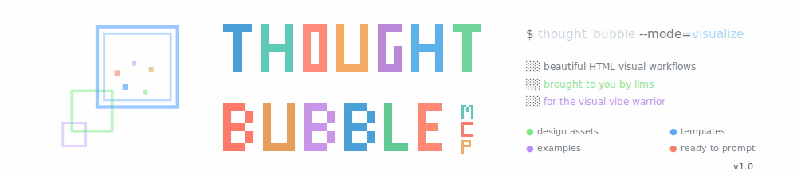

# thought_bubble

**Abrakedabra - your boring documents are now a lovely website with logical flow**

Transform any documentation, system architecture, or plan into beautiful interactive HTML visualizations using AI.

## What Is This?

A prompt-engineering framework that enables LLMs to generate stunning, interactive HTML visualizations from any structured content. No build tools, no frameworks - just pure HTML, CSS, and JavaScript that works everywhere.

## How It Works

1. **You provide:** Your content (markdown, JSON, text, diagrams)
2. **LLM receives:** Prompt template + your content + design asset library
3. **LLM generates:** Custom interactive HTML visualization
4. **You open:** The HTML file in any browser

## Quick Start

### Option 1: Use with Claude/ChatGPT

```
1. Copy the contents of prompt_template.md
2. Attach your source document/content
3. Send to your LLM
4. Receive beautiful HTML visualization
```

### Option 2: Use with Cursor/AI IDE

```
1. Open your documentation file
2. Reference this repo: @thought_bubble
3. Say: "Visualize this using thought_bubble"
4. AI generates custom HTML
```

## What Can You Visualize?

- System architectures
- Development plans
- API documentation
- Organization charts
- Project roadmaps
- Process flows
- Data models
- Integration guides
- Technical specifications
- Knowledge bases
- Anything with structure!

## Features

### Rich Component Library

- **20+ card styles** (info, stats, features, timelines)
- **Navigation patterns** (sidebar, tabs, breadcrumbs, sticky headers)
- **Diagram support** (Mermaid, flowcharts, class diagrams)
- **Interactive elements** (accordions, tabs, tooltips, modals)
- **Layout systems** (grid, masonry, timeline, kanban)

### Professional Design

- **5 color themes** (professional, creative, technical, minimal, dark)
- **Responsive layouts** (mobile, tablet, desktop)
- **Smooth animations** (scroll effects, hover states, transitions)
- **Accessibility** (ARIA labels, keyboard navigation, contrast)

### Self-Contained

- No build process required
- No dependencies (except optional Mermaid CDN)
- Single HTML file output
- Works offline (after first load)
- Copy-paste deployable

## Examples

See the `examples/` folder for:

- **system_architecture.html** - Technical system integration visualization
- **project_plan.html** - Development roadmap with milestones
- **org_structure.html** - Organization hierarchy and teams

## Files in This Repo

```
thought_bubble/
├── README.md                          # This file
├── prompt_template.md                 # Copy-paste prompt for LLM
├── base_template.html                 # Core HTML structure
├── LLM_Design_Assets/
│   ├── design_rules.md               # Design guidance for LLM
│   ├── components/
│   │   ├── cards.html                # Card component library
│   │   ├── navigation.html           # Navigation patterns
│   │   ├── diagrams.html             # Diagram examples
│   │   ├── layouts.html              # Layout systems
│   │   └── interactive.html          # Interactive elements
│   └── styles/
│       ├── color_schemes.css         # Theme definitions
│       ├── animations.css            # Animation library
│       └── responsive.css            # Responsive utilities
└── examples/                          # Example visualizations
```

## Usage Tips

### For Best Results:

1. **Provide structure** - The more organized your content, the better the output
2. **Specify preferences** - Tell the LLM which components/theme you want
3. **Include diagrams** - Mermaid diagrams render beautifully
4. **Define sections** - Clear section headers help create navigation
5. **Add metadata** - Status, dates, authors enhance the visualization

### Example Prompt:

```
Using thought_bubble, create an interactive HTML visualization of this content.

Theme: Professional
Include: Sidebar navigation, Mermaid diagrams, stat cards, timeline layout
Focus: Make complex relationships easy to understand

[Your content here]
```

## Customization

The LLM can customize:
- Color schemes and themes
- Component selection
- Layout structure
- Navigation style
- Animation intensity
- Content organization

## Browser Support

- Chrome/Edge (latest)
- Firefox (latest)
- Safari (latest)
- Mobile browsers (iOS, Android)

## License

MIT License - Use freely in personal and commercial projects

## Credits

Created to make documentation beautiful and accessible.

## Contributing

Contributions welcome! Add new components, themes, or examples via PR.

---

**Make your documentation unforgettable.**
