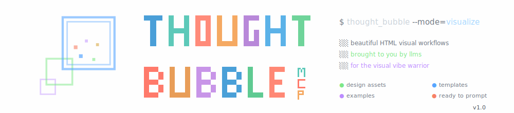

# thought_bubble MCP

**Abrakedabra - your boring documents are now a lovely website with workflow diagrams**

A creative, MCP-native tool that transforms any documentation, system architecture, or plan into beautiful interactive HTML visualisations through seamless AI integratio

## What Is This?

A Model Context Protocol (MCP) server that works with your AI assistant to automatically analyse documentation and generate stunning, interactive HTML visualisations with embedded Mermaid workflow and system diagrams. No build tools, no frameworks - just pure HTML, CSS, and JavaScript that works everywhere.

**MCP-First Design:**
- Native integration with Claude Desktop, Cursor, and any MCP-compatible client
- Automated analysis identifies systems, workflows, and data models in your content
- Smart diagram generation with Mermaid (flowchart, sequence, ER, class, state, C4)
- One-command workflow - just say "visualise this" and your AI handles everything
- No copy-paste required - direct integration with your AI assistant

### See It In Action

<table>
<tr>
<td width="50%">
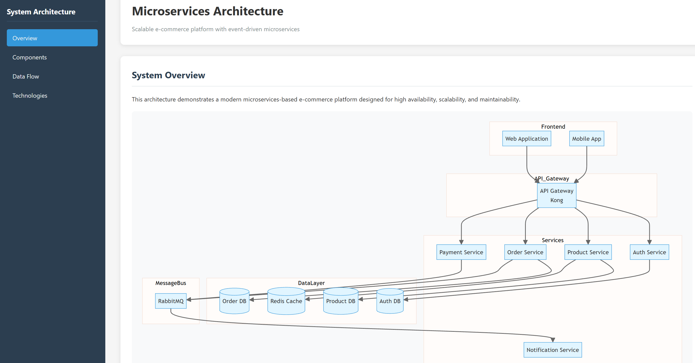
<br><em>Microservices Architecture with interactive diagrams</em>
</td>
<td width="50%">
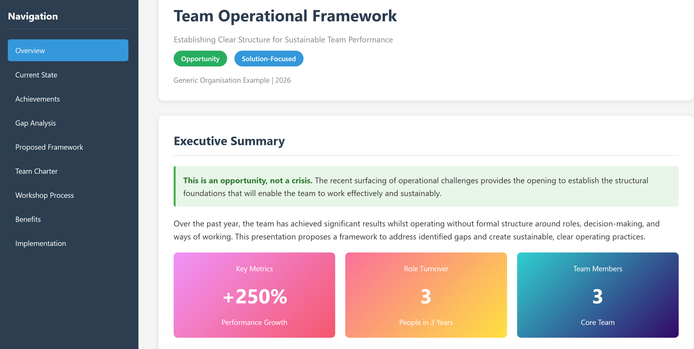
<br><em>Team Operational Framework with metrics</em>
</td>
</tr>
<tr>
<td width="50%">
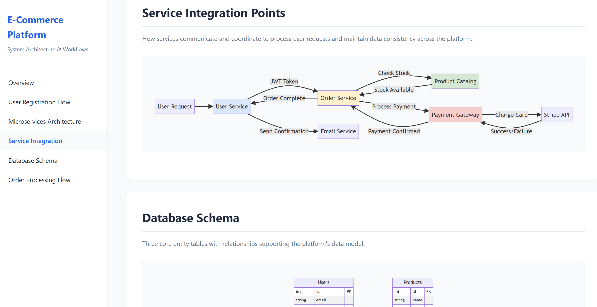
<br><em>E-Commerce Platform with service integration flows</em>
</td>
<td width="50%">
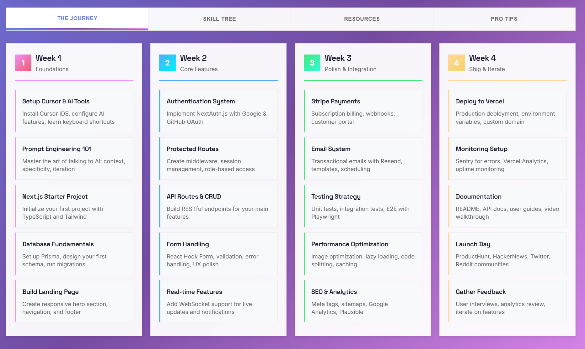
<br><em>Learning journey timeline with weekly milestones</em>
</td>
</tr>
</table>

## How It Works

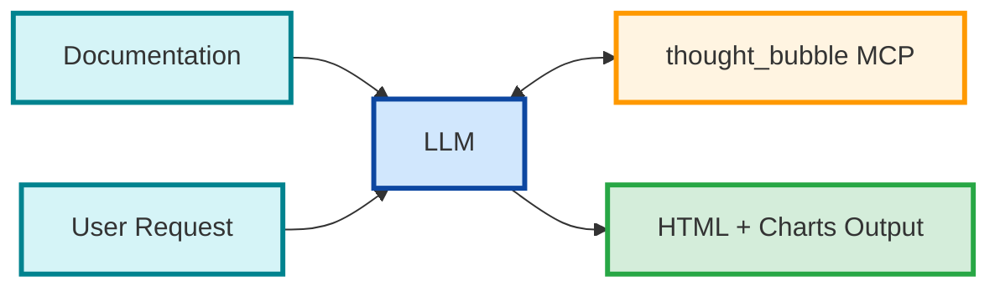
```mermaid
graph LR
    A[Documentation] --> C[LLM]
    B[User Request] --> C
    C <--> D[thought_bubble MCP]
    C --> E[HTML + Charts Output]
    
    style A fill:#d5f4f7,stroke:#00838f,stroke-width:3px
    style B fill:#d5f4f7,stroke:#00838f,stroke-width:3px
    style C fill:#d1e7fd,stroke:#0d47a1,stroke-width:3px
    style D fill:#fff4e1,stroke:#ff9900,stroke-width:3px
    style E fill:#d4edda,stroke:#28a745,stroke-width:3px
```

### The MCP Workflow
1. **You add:** Documents to LLM context
2. **You say:** "Analyse and visualise this documentation"
3. **thought_bubble MCP:** Identifies systems, workflows, data models automatically 
4. **You choose:** Which items to visualise
5. **thought_bubble MCP:** Creates Mermaid diagrams + complete HTML visualisation
6. **You open:** Beautiful visualisation in your browser
7. **You experience:** Clarity and joy

### Alternative: Standalone Prompt Method
For environments without MCP support, you can use the standalone prompt-based approach:
1. Copy `prompt_template.md` + your content
2. Send to your LLM manually
3. Receive generated HTML

## Quick Start

### MCP Installation (Primary Method)

**2-minute setup for Claude Desktop, Cursor, or any MCP client:**

```bash
cd thought_bubble_mcp
npm install && npm run build
```

Then add to your MCP config and restart your AI client:

```json
{
  "mcpServers": {
    "thought-bubble": {
      "command": "node",
      "args": ["/absolute/path/to/thought_bubble/thought_bubble_mcp/dist/index.js"]
    }
  }
}
```

**Note:** Replace `/absolute/path/to/thought_bubble/` with your actual installation path.

**Full instructions:** [`thought_bubble_mcp/START_HERE.md`](thought_bubble_mcp/START_HERE.md)

**Usage:**
```
"Use thought-bubble tools to analyse this content and create a visualisation:

[paste/add your documentation as context]"
```

That's it. Your AI will analyse, generate diagrams, and create the complete HTML visualisation.

## Quick Test - Try It Now

Want to test thought_bubble immediately? We've included three ready-to-use test documents:

### 1. API Integration Documentation
**File:** [`test_doc_1_api_integration.md`](test_doc_1_api_integration.md)

**Content:** Payment Gateway API with authentication flows, service architecture, and data models

**Expected visualisations:**
- Service architecture diagram (flowchart)
- Payment processing sequence (sequence diagram)
- Data model relationships (ER diagram)

### 2. Product Roadmap
**File:** [`test_doc_2_product_roadmap.md`](test_doc_2_product_roadmap.md)

**Content:** 2026 development roadmap with 9 phases across 4 quarters

**Expected visualisations:**
- Development timeline (gantt-style flowchart)
- Feature dependencies (flowchart)
- Resource allocation

### 3. Organisational Structure
**File:** [`test_doc_3_org_structure.md`](test_doc_3_org_structure.md)

**Content:** Company hierarchy with 8 executives, VPs, and decision-making frameworks

**Expected visualisations:**
- Executive leadership hierarchy (flowchart)
- Decision-making flow (flowchart)
- Team distribution

**To test:**
1. Open any test document in your AI assistant
2. Say: "Use thought-bubble to analyse and visualise this documentation"
3. Choose which systems to visualise from the identified list
4. Receive your interactive HTML visualisation

### Alternative Methods (Without MCP)

**For Claude/ChatGPT (Manual prompt):**
1. Copy contents of `prompt_template.md`
2. Attach your source document
3. Send to your LLM
4. Receive HTML visualisation

**For Cursor/AI IDE (Workspace reference):**
1. Open your documentation file
2. Reference: `@thought_bubble`
3. Say: "Visualise this using thought_bubble"
4. AI generates custom HTML

## What Can You Visualise?

- System architectures
- Development plans
- API documentation
- Organisation charts
- Project roadmaps
- Process flows
- Data models
- Integration guides
- Technical specifications
- Knowledge bases
- Anything with structure!

## Features

### Rich Component Library

- **20+ card styles** (info, stats, features, timelines)
- **Navigation patterns** (sidebar, tabs, breadcrumbs, sticky headers)
- **Diagram support** (Mermaid, flowcharts, class diagrams)
- **Interactive elements** (accordions, tabs, tooltips, modals)
- **Layout systems** (grid, masonry, timeline, kanban)

### Professional Design

- **5 color themes** (professional, creative, technical, minimal, dark)
- **Responsive layouts** (mobile, tablet, desktop)
- **Smooth animations** (scroll effects, hover states, transitions)
- **Accessibility** (ARIA labels, keyboard navigation, contrast)

### Self-Contained

- No build process required
- No dependencies (except optional Mermaid CDN)
- Single HTML file output
- Works offline (after first load)
- Copy-paste deployable

## Mermaid Diagram Types

thought_bubble supports the full range of Mermaid diagram types to visualise your documentation. Here are some of the most useful ones:

**[View all 17 diagram examples in the examples README](examples/README.md#live-diagram-examples)**

### Gantt Chart: Project Timeline
Perfect for project planning, roadmaps, and scheduling:

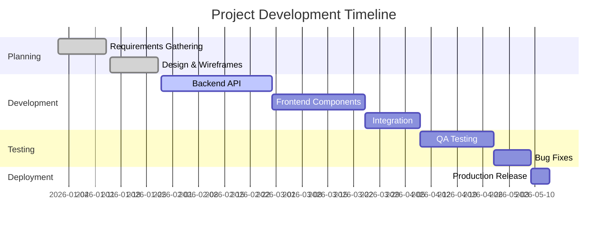
```mermaid
gantt
    title Project Development Timeline
    dateFormat YYYY-MM-DD
    section Planning
    Requirements Gathering    :done,    req, 2026-01-01, 2026-01-14
    Design & Wireframes       :done,    des, 2026-01-15, 2026-01-28
    section Development
    Backend API               :active,  dev1, 2026-01-29, 30d
    Frontend Components       :         dev2, after dev1, 25d
    Integration               :         dev3, after dev2, 15d
    section Testing
    QA Testing                :         test, after dev3, 20d
    Bug Fixes                 :         fix, after test, 10d
    section Deployment
    Production Release        :         rel, after fix, 5d
```

### Sequence Diagram: Order Processing
Essential for API flows, service interactions, and message passing:

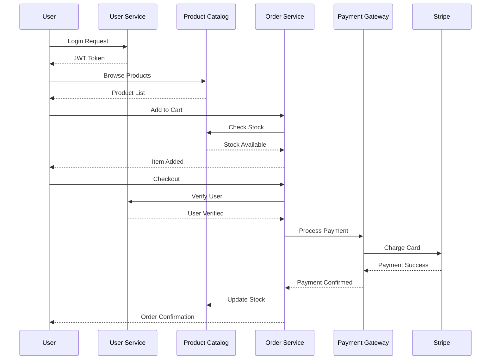
```mermaid
sequenceDiagram
    participant User
    participant UserService as User Service
    participant ProductCatalog as Product Catalog
    participant OrderService as Order Service
    participant PaymentGateway as Payment Gateway
    participant Stripe
    
    User->>UserService: Login Request
    UserService-->>User: JWT Token
    
    User->>ProductCatalog: Browse Products
    ProductCatalog-->>User: Product List
    
    User->>OrderService: Add to Cart
    OrderService->>ProductCatalog: Check Stock
    ProductCatalog-->>OrderService: Stock Available
    OrderService-->>User: Item Added
    
    User->>OrderService: Checkout
    OrderService->>UserService: Verify User
    UserService-->>OrderService: User Verified
    
    OrderService->>PaymentGateway: Process Payment
    PaymentGateway->>Stripe: Charge Card
    Stripe-->>PaymentGateway: Payment Success
    PaymentGateway-->>OrderService: Payment Confirmed
    
    OrderService->>ProductCatalog: Update Stock
    OrderService-->>User: Order Confirmation
```

### User Journey: Onboarding Experience
Ideal for mapping user experiences and touchpoints:

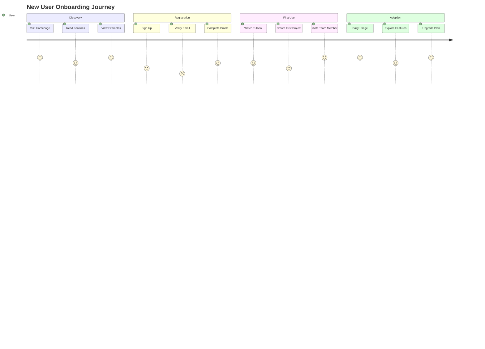
```mermaid
journey
    title New User Onboarding Journey
    section Discovery
      Visit Homepage: 5: User
      Read Features: 4: User
      View Examples: 5: User
    section Registration
      Sign Up: 3: User
      Verify Email: 2: User
      Complete Profile: 4: User
    section First Use
      Watch Tutorial: 4: User
      Create First Project: 3: User
      Invite Team Member: 5: User
    section Adoption
      Daily Usage: 5: User
      Explore Features: 4: User
      Upgrade Plan: 5: User
```

### Flowchart: User Registration Flow
Great for processes, workflows, and decision trees:

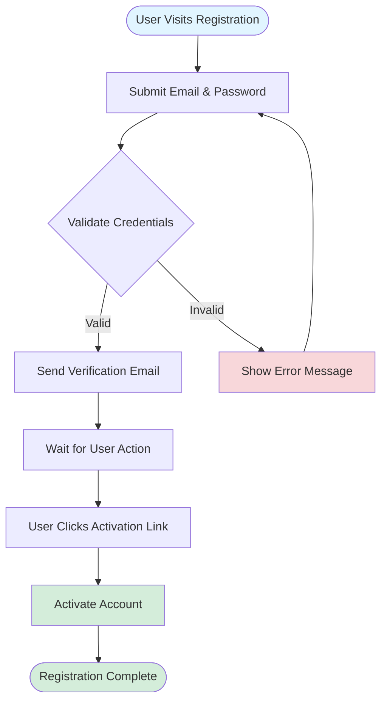
```mermaid
flowchart TD
    Start([User Visits Registration]) --> Submit[Submit Email & Password]
    Submit --> Validate{Validate Credentials}
    Validate -->|Valid| SendEmail[Send Verification Email]
    Validate -->|Invalid| Error[Show Error Message]
    Error --> Submit
    SendEmail --> WaitClick[Wait for User Action]
    WaitClick --> Click[User Clicks Activation Link]
    Click --> Activate[Activate Account]
    Activate --> Success([Registration Complete])
    
    style Start fill:#e1f5ff
    style Success fill:#d4edda
    style Error fill:#f8d7da
    style Activate fill:#d4edda
```

### State Diagram: Order Lifecycle
Perfect for state machines, status flows, and lifecycle management:

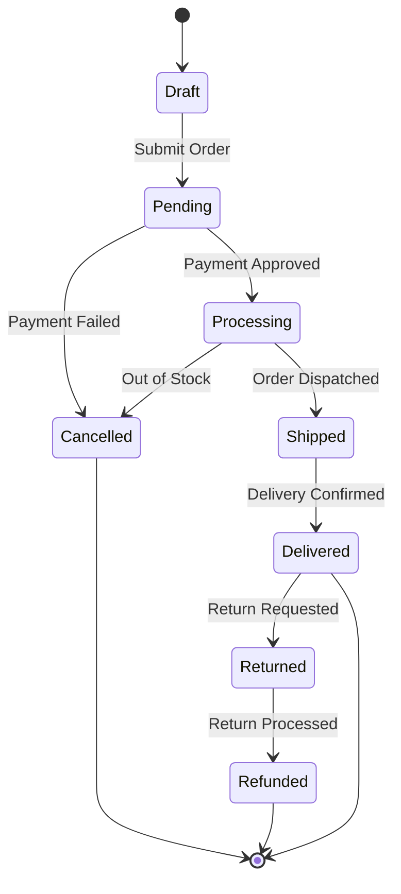
```mermaid
stateDiagram-v2
    [*] --> Draft
    Draft --> Pending: Submit Order
    Pending --> Processing: Payment Approved
    Pending --> Cancelled: Payment Failed
    Processing --> Shipped: Order Dispatched
    Processing --> Cancelled: Out of Stock
    Shipped --> Delivered: Delivery Confirmed
    Delivered --> Returned: Return Requested
    Returned --> Refunded: Return Processed
    Cancelled --> [*]
    Refunded --> [*]
    Delivered --> [*]
```

**Plus many more:** ER diagrams, class diagrams, Git graphs, pie charts, quadrant charts, and C4 architecture diagrams. [See all examples](examples/README.md#live-diagram-examples)

## Files in This Repo

```
thought_bubble/
├── README.md                          # This file
├── thought_bubble_mcp/                # MCP Server (Primary interface)
│   ├── START_HERE.md                 # MCP quick start guide
│   ├── QUICKSTART.md                 # 5-minute setup
│   ├── README.md                     # Complete MCP documentation
│   ├── src/                          # TypeScript source code
│   └── dist/                         # Built server (after npm run build)
├── LLM_Design_Assets/                 # Design system for generated HTML
│   ├── design_rules.md               # Design guidance for LLM
│   ├── components/
│   │   ├── cards.html                # Card component library
│   │   ├── navigation.html           # Navigation patterns
│   │   ├── diagrams.html             # Diagram examples
│   │   ├── layouts.html              # Layout systems
│   │   └── interactive.html          # Interactive elements
│   └── styles/
│       ├── color_schemes.css         # Theme definitions
│       ├── animations.css            # Animation library
│       └── responsive.css            # Responsive utilities
├── examples/                          # Example visualisations
├── base_template.html                 # Core HTML structure
└── prompt_template.md                 # Legacy: Manual prompt for non-MCP use
```

## Usage Tips

### For Best Results:

1. **Provide structure** - The more organised your content, the better the output
2. **Specify preferences** - Tell the LLM which components/theme you want
3. **Include diagrams** - Mermaid diagrams render beautifully
4. **Define sections** - Clear section headers help create navigation
5. **Add metadata** - Status, dates, authors enhance the visualisation

### Example MCP Usage:

**Simply ask your AI:**
```
"Use thought-bubble to analyse and visualise this system architecture documentation.
I'd like flowcharts for the workflows and a professional theme with sidebar navigation."

[paste your documentation]
```

The AI will use the MCP tools to analyse, create diagrams, and generate the complete visualisation.

**For manual/legacy prompt method:**
```
Using thought_bubble, create an interactive HTML visualisation of this content.
Theme: Professional
Include: Sidebar navigation, Mermaid diagrams, stat cards, timeline layout

[Your content here]
```

## Customisation

The LLM can customise:
- Color schemes and themes
- Component selection
- Layout structure
- Navigation style
- Animation intensity
- Content organisation

## MCP Tools

The thought_bubble MCP server exposes two powerful tools that your AI assistant can use:

### `analyse_content`
Your AI uses this to analyse documentation and identify:
- **Workflows** (processes, sequences, flows)
- **Systems** (architectures, components, services)
- **Data Models** (entities, schemas, objects)
- **Relationships** (connections, integrations)

Returns a structured list of visualisation opportunities for you to select from.

### `generate_visualisation`
Your AI uses this to generate the final interactive HTML with:
- **Mermaid diagrams** (flowchart, sequence, class, ER, state, C4)
- **Theme selection** (professional, dark, technical, minimal, creative)
- **Navigation styles** (sidebar, tabs, minimal)
- **Responsive design** for all devices

**Complete MCP documentation:** [`thought_bubble_mcp/`](thought_bubble_mcp/) directory

## Browser Support

Generated visualisations work in:
- Chrome/Edge (latest)
- Firefox (latest)
- Safari (latest)
- Mobile browsers (iOS, Android)

## License

MIT License - Use freely in personal and commercial projects

## Credits

Created to make documentation beautiful and accessible.

## Contributing

Contributions welcome! We especially value:
- MCP server enhancements (new tools, improved analysis)
- New component patterns and themes
- Example visualisations
- Documentation improvements

Submit via PR.

---

**Make your documentation unforgettable.**
