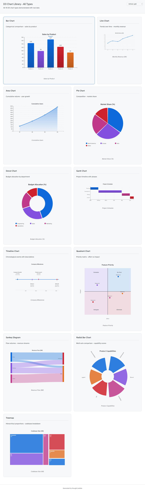
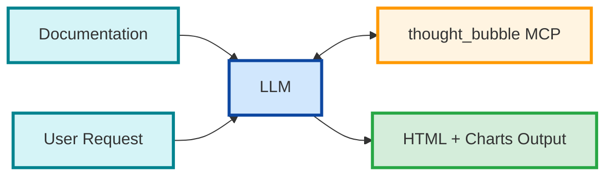
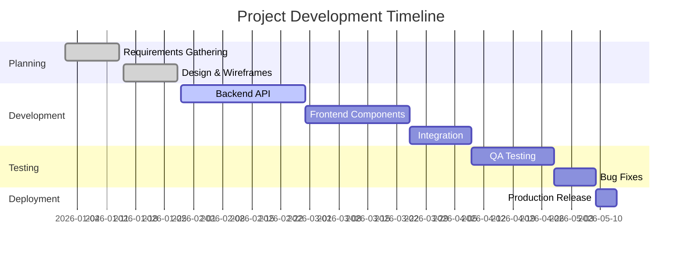
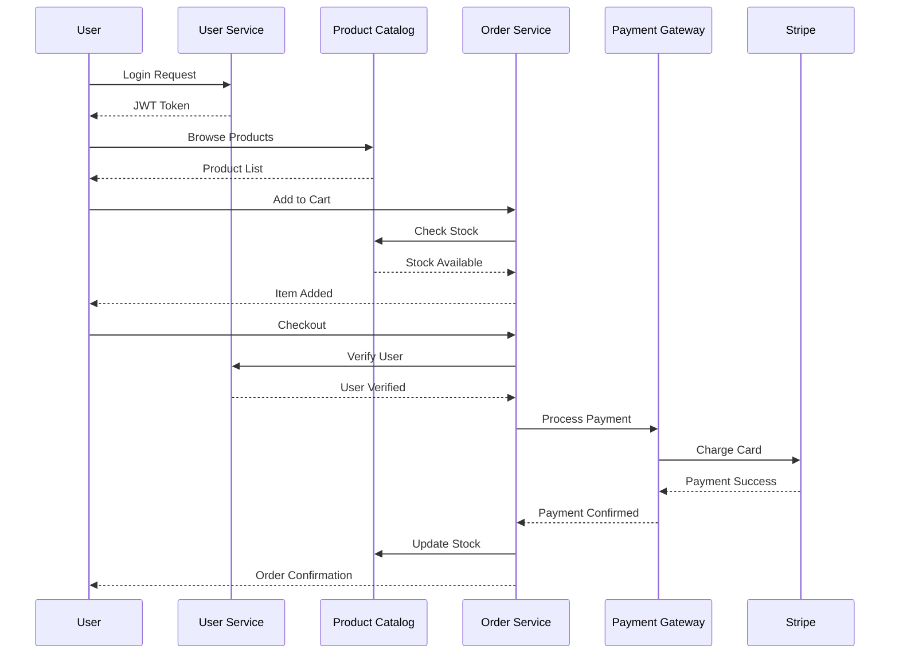
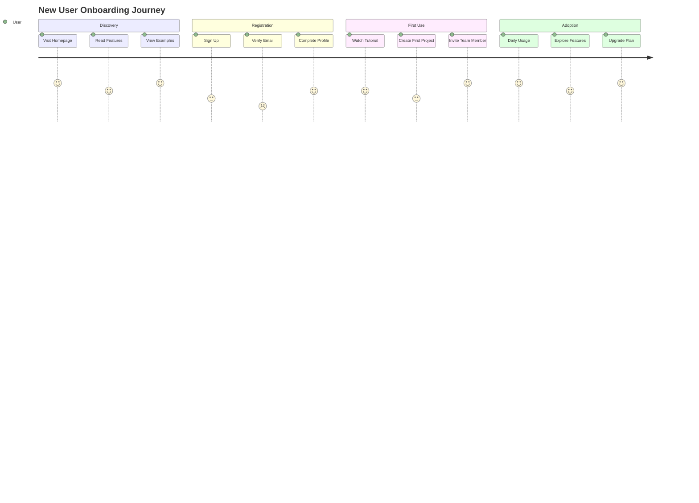
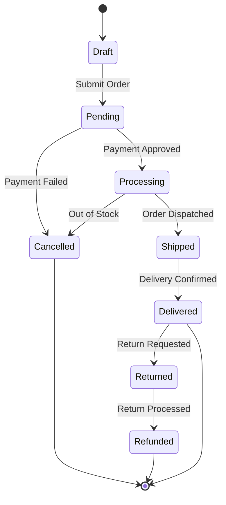

# thought_bubble MCP

**Abrakedabra - your boring documents are now a lovely website with workflow diagrams**

A creative, MCP-native tool that transforms any documentation, system architecture, or plan into beautiful interactive HTML visualisations through seamless AI integration.

<p align="center">

</p>

## What Is This?

A Model Context Protocol (MCP) server that works with your AI assistant to automatically analyse documentation and generate stunning, interactive HTML visualisations with embedded diagrams and charts. No build tools, no frameworks - just pure HTML, CSS, and JavaScript that works everywhere.

**MCP-First Design:**
- Native integration with Claude Desktop, Cursor, and any MCP-compatible client
- Automated analysis identifies systems, workflows, and data models in your content
- **Server-side SVG rendering** with beautiful-mermaid and D3 (no CDN required!)
- Smart diagram generation: Mermaid (flowchart, sequence, ER, class, state) + D3 charts (bar, pie, donut, line, area, gantt, timeline, quadrant, sankey, radial, treemap)
- **13 layout templates** (sidebar, magazine, presentation, dashboard, minimal, editorial, comparison, briefing, tutorial, scorecard, report, dossier, dialogue)
- **Section roles** (metric, pull-quote, lead, statement, full-width, supporting) for fine-grained visual control
- **Density presets** (compact, comfortable, spacious) to match content type
- **12 curated themes** including Tokyo Night, Dracula, Gruvbox, GitHub, and Solarized
- **Advanced chart styling** (annotations, curve types, color strategies, emphasis effects, pattern encoding for accessibility)
- **Live theme switching** - users can change themes without regenerating
- One-command workflow - just say "visualise this" and your AI handles everything
- Self-contained HTML that works completely offline

### See It In Action

**[Browse the full examples gallery →](examples/)**

#### 16 D3 Chart Types

<p align="center">
<a href="examples/all_d3_charts.html">

</a>
<br><em>Bar, line, area, pie, donut, gantt, timeline, quadrant, sankey, radial, treemap - all with annotations, emphasis effects, and live theme switching</em>
</p>

#### Layout Templates

Same content rendered three ways to match your use case:

<table>
<tr>
<td width="33%">
<a href="examples/layout_sidebar.html">

</a>
<br><strong>Sidebar</strong> - Multi-section navigation
<br><em>Best for: API docs, technical references</em>
</td>
<td width="33%">
<a href="examples/layout_magazine.html">

</a>
<br><strong>Magazine</strong> - Hero + narrative flow
<br><em>Best for: Reports, case studies</em>
</td>
<td width="33%">
<a href="examples/layout_dashboard.html">

</a>
<br><strong>Dashboard</strong> - KPI cards + grid
<br><em>Best for: Monitoring, metrics</em>
</td>
</tr>
</table>

#### Full Examples

<table>
<tr>
<td width="50%">
<a href="examples/payment_gateway_integration.html">

</a>
<br><strong>Payment Gateway API</strong>
<br><em>RESTful API docs with sequence diagrams and ER models</em>
</td>
<td width="50%">
<a href="examples/product_roadmap_2026.html">

</a>
<br><strong>Product Roadmap 2026</strong>
<br><em>9-phase development plan with $5M ARR target</em>
</td>
</tr>
</table>

**[View all examples with live previews →](examples/)**

## How It Works


```mermaid
graph LR
    A[Documentation] --> C[LLM]
    B[User Request] --> C
    C <--> D[thought_bubble MCP]
    C --> E[HTML + Charts Output]
    
    style A fill:#d5f4f7,stroke:#00838f,stroke-width:3px
    style B fill:#d5f4f7,stroke:#00838f,stroke-width:3px
    style C fill:#d1e7fd,stroke:#0d47a1,stroke-width:3px
    style D fill:#fff4e1,stroke:#ff9900,stroke-width:3px
    style E fill:#d4edda,stroke:#28a745,stroke-width:3px
```

### The MCP Workflow
1. **You add:** Documents to LLM context
2. **You say:** "Analyse and visualise this documentation"
3. **thought_bubble MCP:** Identifies systems, workflows, data models automatically 
4. **You choose:** Which items to visualise
5. **thought_bubble MCP:** Creates Mermaid diagrams + complete HTML visualisation
6. **You open:** Beautiful visualisation in your browser
7. **You experience:** Clarity and joy

### Alternative: Standalone Prompt Method
For environments without MCP support, you can use the standalone prompt-based approach:
1. Copy `prompt_template.md` + your content
2. Send to your LLM manually
3. Receive generated HTML

## Quick Start

### MCP Installation (Primary Method)

**2-minute setup for Claude Desktop, Cursor, or any MCP client:**

```bash
cd thought_bubble_mcp
npm install && npm run build
```

Then add to your MCP config and restart your AI client:

```json
{
  "mcpServers": {
    "thought-bubble": {
      "command": "node",
      "args": ["/absolute/path/to/thought_bubble/thought_bubble_mcp/dist/index.js"]
    }
  }
}
```

**Note:** Replace `/absolute/path/to/thought_bubble/` with your actual installation path.

**Full instructions:** [`thought_bubble_mcp/START_HERE.md`](thought_bubble_mcp/START_HERE.md)

**Usage:**
```
"Use thought-bubble tools to analyse this content and create a visualisation:

[paste/add your documentation as context]"
```

That's it. Your AI will analyse, generate diagrams, and create the complete HTML visualisation.

## Quick Test - Try It Now

Want to test thought_bubble immediately? We've included three ready-to-use test documents:

### 1. API Integration Documentation
**File:** [`test_inputs/test_doc_1_api_integration.md`](test_inputs/test_doc_1_api_integration.md)

**Content:** Payment Gateway API with authentication flows, service architecture, and data models

**Expected visualisations:**
- Service architecture diagram (flowchart)
- Payment processing sequence (sequence diagram)
- Data model relationships (ER diagram)

### 2. Product Roadmap
**File:** [`test_inputs/test_doc_2_product_roadmap.md`](test_inputs/test_doc_2_product_roadmap.md)

**Content:** 2026 development roadmap with 9 phases across 4 quarters

**Expected visualisations:**
- Development timeline (gantt-style flowchart)
- Feature dependencies (flowchart)
- Resource allocation

### 3. Organisational Structure
**File:** [`test_inputs/test_doc_3_org_structure.md`](test_inputs/test_doc_3_org_structure.md)

**Content:** Company hierarchy with 8 executives, VPs, and decision-making frameworks

**Expected visualisations:**
- Executive leadership hierarchy (flowchart)
- Decision-making flow (flowchart)
- Team distribution

**To test:**
1. Open any test document in your AI assistant
2. Say: "Use thought-bubble to analyse and visualise this documentation"
3. Choose which systems to visualise from the identified list
4. Receive your interactive HTML visualisation

### Alternative Methods (Without MCP)

**For Claude/ChatGPT (Manual prompt):**
1. Copy contents of `prompt_template.md`
2. Attach your source document
3. Send to your LLM
4. Receive HTML visualisation

**For Cursor/AI IDE (Workspace reference):**
1. Open your documentation file
2. Reference: `@thought_bubble`
3. Say: "Visualise this using thought_bubble"
4. AI generates custom HTML

## What Can You Visualise?

- System architectures
- Development plans
- API documentation
- Organisation charts
- Project roadmaps
- Process flows
- Data models
- Integration guides
- Technical specifications
- Knowledge bases
- Anything with structure!

## Features

### 13 Layout Templates

Each optimised for specific content types and use cases:

- **sidebar** - Multi-section docs with fixed navigation (7+ sections)
- **magazine** - Reports and case studies with hero section and pull quotes
- **presentation** - Pitch decks with full-viewport snap-scroll slides
- **dashboard** - KPI monitoring with metric cards and chart grid
- **minimal** - Single-topic deep dives with visual-first hero
- **editorial** - Essays and narratives with centred academic style
- **comparison** - Vendor evaluation with parallel columns
- **briefing** - Sprint reviews with lead item and stats strip
- **tutorial** - Step-by-step guides with progress spine
- **scorecard** - Maturity assessments with semantic-colour scoring
- **report** - RFCs and compliance docs with cover and TOC
- **dossier** - Research synthesis with profile header and facts
- **dialogue** - ADRs with structured arguments and trade-offs

### Section Roles

Fine-grained visual control for individual sections:

- **metric** - Large KPI cards with values and labels
- **pull-quote** - Display-font blockquotes for standout insights
- **lead** - Wider opening paragraphs with larger text
- **statement** - Large centred text for key messages
- **full-width** - Breakout visuals that span viewport
- **supporting** - Appendices and secondary content

### D3 Chart Capabilities

**16+ chart types** - bar, pie, donut, line, area, gantt, timeline, quadrant, sankey, radial, treemap

**Example - Revenue chart with annotations:**
```json
{
  "diagramType": "line",
  "chartData": [
    {"x": "Q1", "y": 1200000},
    {"x": "Q2", "y": 1850000},
    {"x": "Q3", "y": 2100000},
    {"x": "Q4", "y": 3200000}
  ],
  "chartOptions": {
    "curve": "smooth",
    "emphasis": "glow",
    "colorStrategy": "monochrome",
    "annotations": [
      {"label": "Product launch +54%", "x": "Q2", "y": 1850000, "dx": 10, "dy": -20},
      {"label": "Enterprise deals", "x": "Q4", "y": 3200000, "dx": 10, "dy": -20}
    ]
  }
}
```

**Example - Sankey flow diagram:**
```json
{
  "diagramType": "sankey",
  "chartData": [{
    "nodes": [
      {"id": "direct", "label": "Direct Sales"},
      {"id": "partner", "label": "Partners"},
      {"id": "enterprise", "label": "Enterprise"},
      {"id": "smb", "label": "SMB"}
    ],
    "links": [
      {"source": "direct", "target": "enterprise", "value": 45},
      {"source": "direct", "target": "smb", "value": 12},
      {"source": "partner", "target": "enterprise", "value": 28},
      {"source": "partner", "target": "smb", "value": 35}
    ]
  }]
}
```

**Chart options:**
- **Annotations** - Data point labels with dx/dy positioning
- **Curve types** - `smooth`, `natural`, `sharp`, `step`
- **Color strategies** - `categorical`, `sequential`, `diverging`, `monochrome`
- **Emphasis effects** - `glow`, `shadow`, `lift`, `none`
- **Pattern encoding** - `patterns: true` for WCAG compliance
- **Animations** - `stagger`, `draw`, `grow`, `fade`, `none`

### Professional Design

- **12 curated themes** - Tokyo Night, Dracula, Gruvbox, Solarized Dark/Light, GitHub Dark/Light, Professional, Creative, Technical, Minimal, Dark
- **Typography pairings** - Theme-specific font combinations (display + body + mono)
- **Density presets** - Compact (information-dense), comfortable (balanced), spacious (generous whitespace)
- **Live theme switching** - Users can change themes in the browser without regenerating
- **Responsive layouts** - Mobile, tablet, desktop breakpoints
- **Smooth animations** - Entry choreography, hover states, transitions
- **Accessibility** - ARIA labels, keyboard navigation, WCAG AA contrast, pattern encoding

### Self-Contained

- No build process required
- No dependencies (except optional Mermaid CDN)
- Single HTML file output
- Works offline (after first load)
- Copy-paste deployable

## Chart and Diagram Types

thought_bubble supports a comprehensive range of visualization types. See [`showcase_examples/README.md`](showcase_examples/README.md) for live examples of each.

### D3 Charts

- **bar** - Exact comparison, categorical data with rounded bars and value labels
- **line** - Trends over time with configurable curve interpolation
- **area** - Cumulative volume, growth trajectories with gradient fills
- **pie/donut** - Composition breakdown (maximum 6 categories recommended)
- **radial** - Multi-axis comparison in circular layout
- **gantt** - Project timelines and milestone schedules
- **timeline** - Chronological event sequences with central spine
- **quadrant** - 2D positioning matrices (priority, impact analysis)
- **sankey** - Flow volumes and revenue streams
- **treemap** - Hierarchical proportions and taxonomy

### Mermaid Diagrams

- **flowchart** - Processes, workflows, decision trees, architecture
- **sequence** - API interactions, authentication flows, message passing
- **class** - Object models, data structures, relationships
- **er** - Database schemas, entity relationships
- **state** - State machines, status transitions, lifecycle management

Note: C4 diagrams are not currently supported.

**[View comprehensive examples with all chart types](showcase_examples/README.md)**

### Gantt Chart: Project Timeline
Perfect for project planning, roadmaps, and scheduling:


```mermaid
gantt
    title Project Development Timeline
    dateFormat YYYY-MM-DD
    section Planning
    Requirements Gathering    :done,    req, 2026-01-01, 2026-01-14
    Design & Wireframes       :done,    des, 2026-01-15, 2026-01-28
    section Development
    Backend API               :active,  dev1, 2026-01-29, 30d
    Frontend Components       :         dev2, after dev1, 25d
    Integration               :         dev3, after dev2, 15d
    section Testing
    QA Testing                :         test, after dev3, 20d
    Bug Fixes                 :         fix, after test, 10d
    section Deployment
    Production Release        :         rel, after fix, 5d
```

### Sequence Diagram: Order Processing
Essential for API flows, service interactions, and message passing:


```mermaid
sequenceDiagram
    participant User
    participant UserService as User Service
    participant ProductCatalog as Product Catalog
    participant OrderService as Order Service
    participant PaymentGateway as Payment Gateway
    participant Stripe
    
    User->>UserService: Login Request
    UserService-->>User: JWT Token
    
    User->>ProductCatalog: Browse Products
    ProductCatalog-->>User: Product List
    
    User->>OrderService: Add to Cart
    OrderService->>ProductCatalog: Check Stock
    ProductCatalog-->>OrderService: Stock Available
    OrderService-->>User: Item Added
    
    User->>OrderService: Checkout
    OrderService->>UserService: Verify User
    UserService-->>OrderService: User Verified
    
    OrderService->>PaymentGateway: Process Payment
    PaymentGateway->>Stripe: Charge Card
    Stripe-->>PaymentGateway: Payment Success
    PaymentGateway-->>OrderService: Payment Confirmed
    
    OrderService->>ProductCatalog: Update Stock
    OrderService-->>User: Order Confirmation
```

### User Journey: Onboarding Experience
Ideal for mapping user experiences and touchpoints:


```mermaid
journey
    title New User Onboarding Journey
    section Discovery
      Visit Homepage: 5: User
      Read Features: 4: User
      View Examples: 5: User
    section Registration
      Sign Up: 3: User
      Verify Email: 2: User
      Complete Profile: 4: User
    section First Use
      Watch Tutorial: 4: User
      Create First Project: 3: User
      Invite Team Member: 5: User
    section Adoption
      Daily Usage: 5: User
      Explore Features: 4: User
      Upgrade Plan: 5: User
```

### Flowchart: User Registration Flow
Great for processes, workflows, and decision trees:


```mermaid
flowchart TD
    Start([User Visits Registration]) --> Submit[Submit Email & Password]
    Submit --> Validate{Validate Credentials}
    Validate -->|Valid| SendEmail[Send Verification Email]
    Validate -->|Invalid| Error[Show Error Message]
    Error --> Submit
    SendEmail --> WaitClick[Wait for User Action]
    WaitClick --> Click[User Clicks Activation Link]
    Click --> Activate[Activate Account]
    Activate --> Success([Registration Complete])
    
    style Start fill:#e1f5ff
    style Success fill:#d4edda
    style Error fill:#f8d7da
    style Activate fill:#d4edda
```

### State Diagram: Order Lifecycle
Perfect for state machines, status flows, and lifecycle management:


```mermaid
stateDiagram-v2
    [*] --> Draft
    Draft --> Pending: Submit Order
    Pending --> Processing: Payment Approved
    Pending --> Cancelled: Payment Failed
    Processing --> Shipped: Order Dispatched
    Processing --> Cancelled: Out of Stock
    Shipped --> Delivered: Delivery Confirmed
    Delivered --> Returned: Return Requested
    Returned --> Refunded: Return Processed
    Cancelled --> [*]
    Refunded --> [*]
    Delivered --> [*]
```

**Plus many more:** ER diagrams, class diagrams, Git graphs, pie charts, quadrant charts, and C4 architecture diagrams. [See all examples](examples/README.md#live-diagram-examples)

## Files in This Repo

```
thought_bubble/
├── README.md                          # This file
├── thought_bubble_mcp/                # MCP Server (Primary interface)
│   ├── START_HERE.md                 # MCP quick start guide
│   ├── README.md                     # Complete MCP documentation
│   ├── ARCHITECTURE.md               # Complete architectural reference
│   ├── THEMES.md                     # Theme documentation
│   ├── src/                          # TypeScript source code
│   │   ├── index.ts                  # MCP server entry point
│   │   ├── tools/                    # Tool implementations
│   │   ├── renderers/                # D3 and Mermaid rendering
│   │   ├── builders/                 # HTML assembly
│   │   ├── themes/                   # Theme system
│   │   └── prompts/                  # LLM prompt templates
│   ├── scripts/                      # Showcase generation scripts
│   └── dist/                         # Built server (after npm run build)
├── LLM_Design_Assets/                 # Design system documentation
│   └── ESSENTIAL_DESIGN_RULES.md     # Core design principles
├── DesignTeam/                        # Internal design documentation
│   └── DesignGuide/                  # Detailed design guides (POV, Typography, Layouts, D3, Color, Spacing)
├── showcase_examples/                 # 13 comprehensive example visualizations
│   ├── README.md                     # Detailed example documentation
│   ├── index.html                    # Example gallery
│   └── *.html                        # Individual examples
├── test_inputs/                       # Test documents for generating examples
├── base_template.html                 # Core HTML structure
└── prompt_template.md                 # Legacy: Manual prompt for non-MCP use
```

## Usage Tips

### For Best Results:

1. **Provide structure** - The more organised your content, the better the output
2. **Specify preferences** - Tell the LLM which components/theme you want
3. **Include diagrams** - Mermaid diagrams render beautifully
4. **Define sections** - Clear section headers help create navigation
5. **Add metadata** - Status, dates, authors enhance the visualisation

### Example MCP Usage:

**Simply ask your AI:**
```
"Use thought-bubble to analyse and visualise this system architecture documentation.
I'd like flowcharts for the workflows and a professional theme with sidebar navigation."

[paste your documentation]
```

The AI will use the MCP tools to analyse, create diagrams, and generate the complete visualisation.

**For manual/legacy prompt method:**
```
Using thought_bubble, create an interactive HTML visualisation of this content.
Theme: Professional
Include: Sidebar navigation, Mermaid diagrams, stat cards, timeline layout

[Your content here]
```

## Customisation

The LLM can customise:
- Color schemes and themes
- Component selection
- Layout structure
- Navigation style
- Animation intensity
- Content organisation

## MCP Tools

The thought_bubble MCP server exposes 5 tools for your AI assistant:

### `analyze_content`
Analyses documentation to identify visualisation opportunities:
- **Workflows** (processes, sequences, flows)
- **Systems** (architectures, components, services)
- **Data Models** (entities, schemas, objects)
- **Metrics/KPIs** (key performance indicators)

Returns structured analysis with layout recommendations.

### `generate_visualization`
Generates complete self-contained HTML with:
- **13 layout templates** (sidebar, magazine, presentation, dashboard, minimal, editorial, comparison, briefing, tutorial, scorecard, report, dossier, dialogue)
- **Section roles** (metric, pull-quote, lead, statement, full-width, supporting)
- **Density presets** (compact, comfortable, spacious)
- **16+ diagram/chart types** (Mermaid + D3)
- **Advanced chart options** (annotations, curve types, color strategies, emphasis effects, patterns)
- **12 themes** with live switching capability
- **Responsive design** for all devices

### `generate_mermaid_prompt`
Returns prompt template to help LLMs generate Mermaid diagram code.

### `list_themes`
Lists all 12 available themes with their details (name, mode, category, personality).

### `get_design_guide`
Retrieves design guide documentation (POV, Typography, Layouts, D3StyleGuide, ColorTheory, Spacing).

**Complete MCP documentation:** [`thought_bubble_mcp/README.md`](thought_bubble_mcp/README.md) | **Architecture reference:** [`thought_bubble_mcp/ARCHITECTURE.md`](thought_bubble_mcp/ARCHITECTURE.md)

## Browser Support

Generated visualisations work in:
- Chrome/Edge (latest)
- Firefox (latest)
- Safari (latest)
- Mobile browsers (iOS, Android)

## License

MIT License - Use freely in personal and commercial projects

## Credits

Created to make documentation beautiful and accessible.

## Contributing

Contributions welcome! We especially value:
- MCP server enhancements (new tools, improved analysis)
- New component patterns and themes
- Example visualisations
- Documentation improvements

Submit via PR.

---

**Make your documentation unforgettable.**
