# thought_bubble Examples

**Abrakedabra - your boring documents are now a lovely website with logical flow**

This folder contains example HTML visualizations demonstrating different use cases for the thought_bubble framework.

## Live Diagram Examples

These are actual Mermaid diagrams extracted from our example visualisations, rendered natively in GitHub:

### Flowchart: User Registration Flow
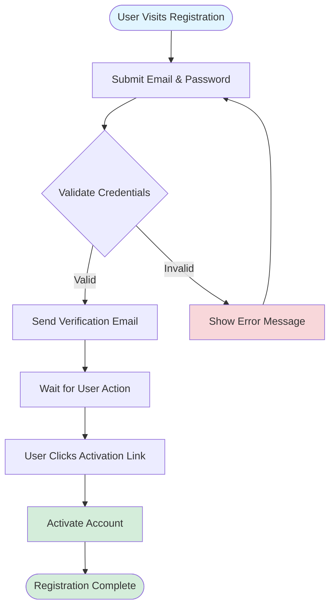

### Graph: Microservices Architecture
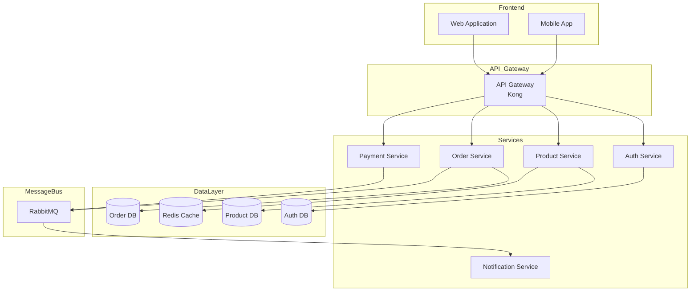

### Flowchart: Service Integration Points
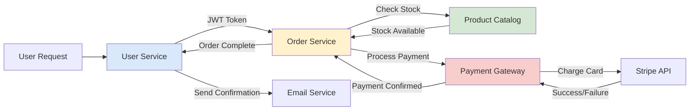

### Sequence Diagram: Order Processing
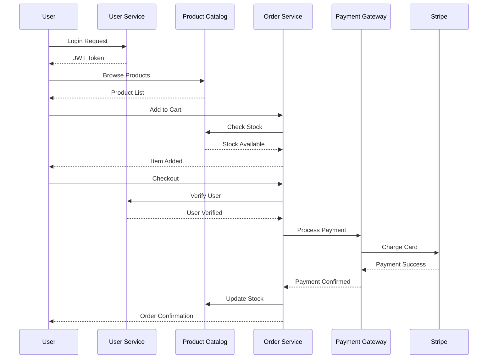

### ER Diagram: Database Schema
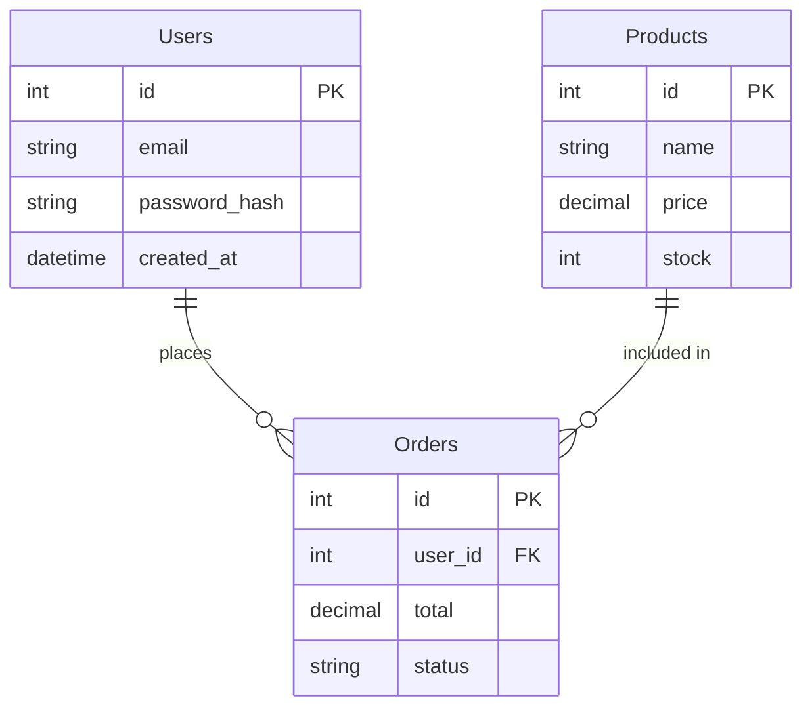

### Graph: Pattern Integration System
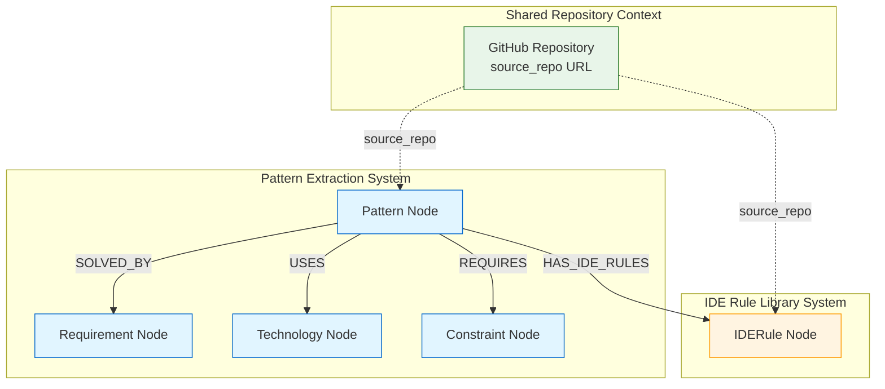

### Class Diagram: Data Models
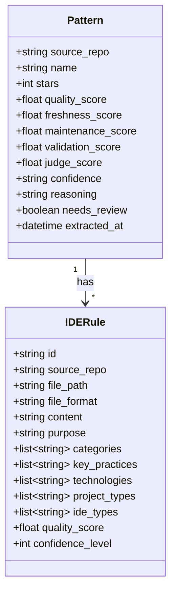

### Graph: Team Current State Analysis
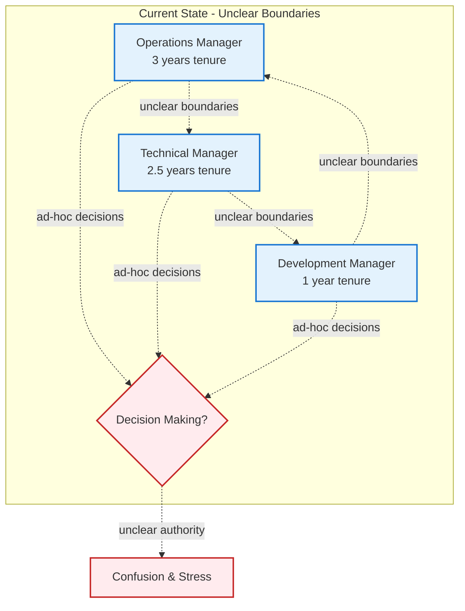

### Graph: Proposed Framework Structure
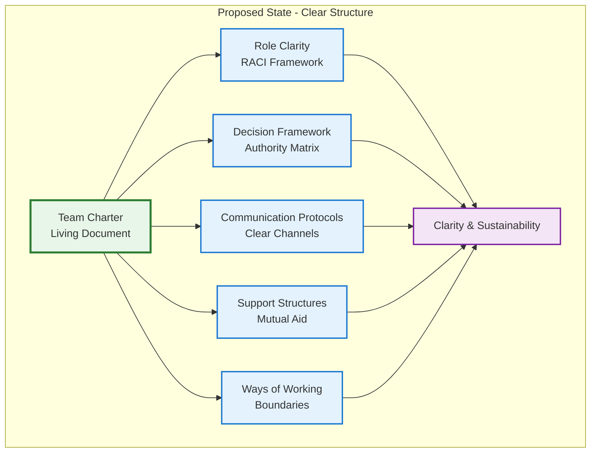

### Sequence Diagram: API Gateway Flow
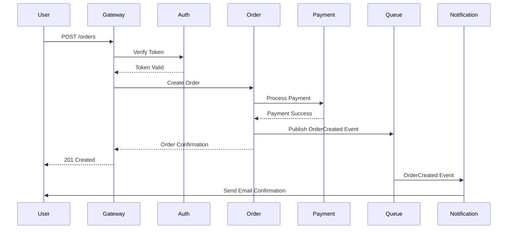

### State Diagram: Order Lifecycle
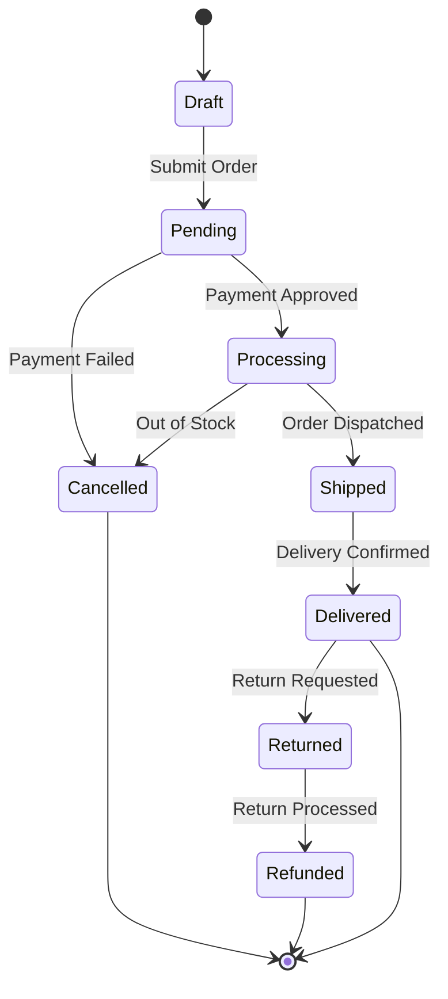

### Gantt Chart: Project Timeline
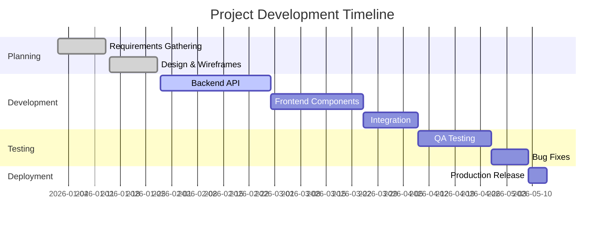

### Journey: User Onboarding Experience
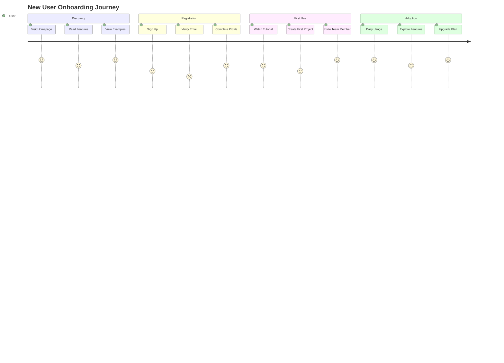

### Git Graph: Development Workflow
```mermaid
gitgraph
    commit id: "Initial commit"
    commit id: "Add base template"
    branch feature/auth
    checkout feature/auth
    commit id: "Add login page"
    commit id: "Add authentication"
    checkout main
    branch feature/dashboard
    checkout feature/dashboard
    commit id: "Create dashboard layout"
    commit id: "Add widgets"
    checkout main
    merge feature/auth
    commit id: "Update dependencies"
    checkout feature/dashboard
    commit id: "Polish dashboard"
    checkout main
    merge feature/dashboard tag: "v1.0.0"
    commit id: "Production release"
```

### Pie Chart: Technology Stack Distribution
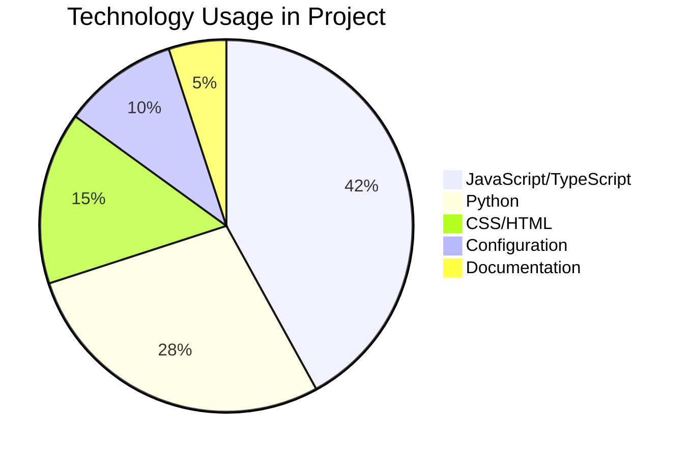

### Quadrant Chart: Feature Priority Matrix
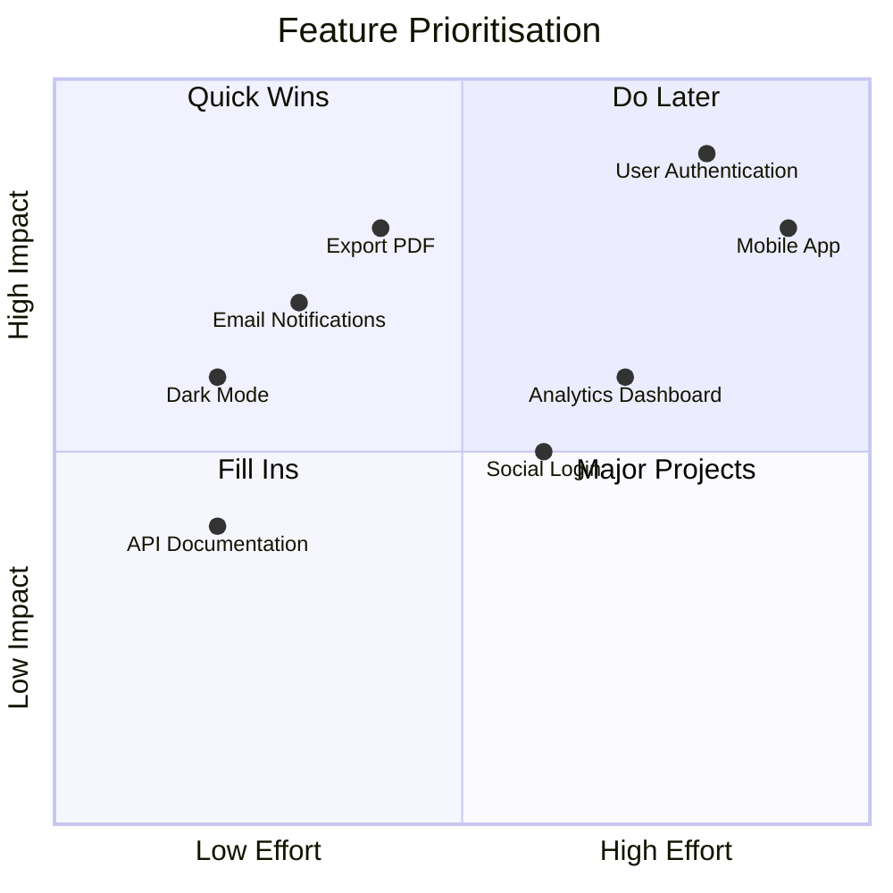

---

## Examples

### 1. Pattern-Rule Integration Example (The Original)
**File:** `pattern_rule_integration_example.html`

**Use Case:** The visualization that started it all! Technical knowledge graph integration documentation

**Features Demonstrated:**
- Technical architecture diagrams (Mermaid)
- Class diagrams for data models
- Sidebar navigation
- Property lists for API specifications
- Code blocks with syntax highlighting (Neo4j Cypher)
- Gradient use case cards
- Quality scoring comparison tables
- Integration point documentation
- System independence documentation

**Best For:**
- Technical system integration specs
- API documentation
- Database schema visualization
- Knowledge graph documentation
- Architecture decision records
- System design documents

---

### 2. System Architecture Example
**File:** `system_architecture_example.html`

**Use Case:** Visualizing technical system architecture and microservices

**Features Demonstrated:**
- Sidebar navigation
- Mermaid diagrams (architecture, sequence)
- Component cards with colour categorization
- Property list cards for specifications
- Responsive grid layout
- Professional theme

**Best For:**
- Technical documentation
- System design documents
- Architecture decision records
- Integration guides

---

### 3. AI-Powered Learning Path
**File:** `learning_path_example.html`

**Use Case:** Educational journey and skill development tracking

**Features Demonstrated:**
- Hero section with statistics
- Timeline layout (4-week progression)
- Progress bars for skill tracking
- Accordion FAQs (common pitfalls)
- Code blocks with copy buttons
- Resource cards with links
- Colour-coded timeline markers

**Best For:**
- Course curricula
- Onboarding guides
- Training programs
- Skill development paths
- Tutorial series

---

### 4. Travel Itinerary Planner
**File:** `travel_itinerary_example.html`

**Use Case:** Complete travel guide with day-by-day planning

**Features Demonstrated:**
- Sticky top navigation
- Day-by-day timeline cards
- Budget breakdown with gradient cards
- Comparison table (accommodations)
- Packing list with categories
- Tips and emergency information
- Non-technical, universal appeal

**Best For:**
- Trip planning guides
- Event schedules
- Conference agendas
- Workshop timetables
- Personal planning

---

## How to Use These Examples

### 1. Open Directly
Simply open any HTML file in your web browser:
```bash
# Windows
start examples/system_architecture_example.html

# macOS
open examples/system_architecture_example.html

# Linux
xdg-open examples/system_architecture_example.html
```

### 2. As Templates
Copy an example and modify it for your needs:
```bash
cp examples/system_architecture_example.html my-documentation.html
# Edit my-documentation.html with your content
```

### 3. As Learning Material
Study the examples to understand:
- How components are structured
- How themes are applied
- How Mermaid diagrams are integrated
- How responsive layouts work
- How navigation is implemented

---

## Customization Tips

### Change Theme
Replace the CSS variables in the `:root` selector:
```css
:root {
    --primary: #your-color;
    --secondary: #your-color;
    /* etc. */
}
```

### Remove Sidebar
1. Delete the `<aside class="sidebar">` section
2. Change `.main-content { margin-left: 280px; }` to `margin-left: 0;`

### Add Components
Copy component styles from `LLM_Design_Assets/components/` and paste into the `<style>` section.

### Modify Layout
Change the grid columns:
```css
.grid {
    grid-template-columns: repeat(auto-fit, minmax(300px, 1fr));
    /* Adjust minmax values for different card sizes */
}
```

---

## Creating Your Own

### Option 1: Use the Prompt Template
1. Open `prompt_template.md`
2. Add your content
3. Send to an LLM (Claude, ChatGPT)
4. Receive custom HTML visualization

### Option 2: Use Base Template
1. Copy `base_template.html`
2. Replace placeholder content
3. Add components from the component library
4. Customize styles as needed

### Option 3: Modify Examples
1. Copy an example that matches your needs
2. Replace content sections
3. Adjust colors/styling
4. Remove/add sections as needed

---

## Component Reference

All examples use components from:
- `LLM_Design_Assets/components/cards.html`
- `LLM_Design_Assets/components/navigation.html`
- `LLM_Design_Assets/components/diagrams.html`
- `LLM_Design_Assets/components/layouts.html`

Refer to these files for:
- Available component styles
- Usage examples
- Customization options

---

## Browser Compatibility

All examples work in:
- Chrome/Edge (latest)
- Firefox (latest)
- Safari (latest)
- Mobile browsers (iOS, Android)

**Note:** Mermaid diagrams require JavaScript enabled.

---

## Tips for Best Results

### Performance
- Keep diagrams reasonably sized
- Use CSS animations sparingly
- Test on mobile devices

### Accessibility
- Maintain heading hierarchy (h1 → h2 → h3)
- Ensure color contrast meets WCAG AA
- Test keyboard navigation
- Add alt text to images

### Content
- Break long sections into cards
- Use diagrams for complex relationships
- Add navigation for documents with 5+ sections
- Include table of contents for long pages

---

## Need Help?

Refer to:
- `README.md` - Main documentation
- `prompt_template.md` - LLM prompts
- `LLM_Design_Assets/design_rules.md` - Design guidance
- Component library files for specific components

---

**These examples demonstrate the versatility of the Doc Visualizer framework. Use them as inspiration for your own documentation!**
