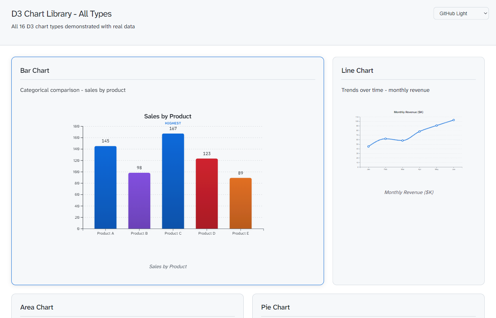
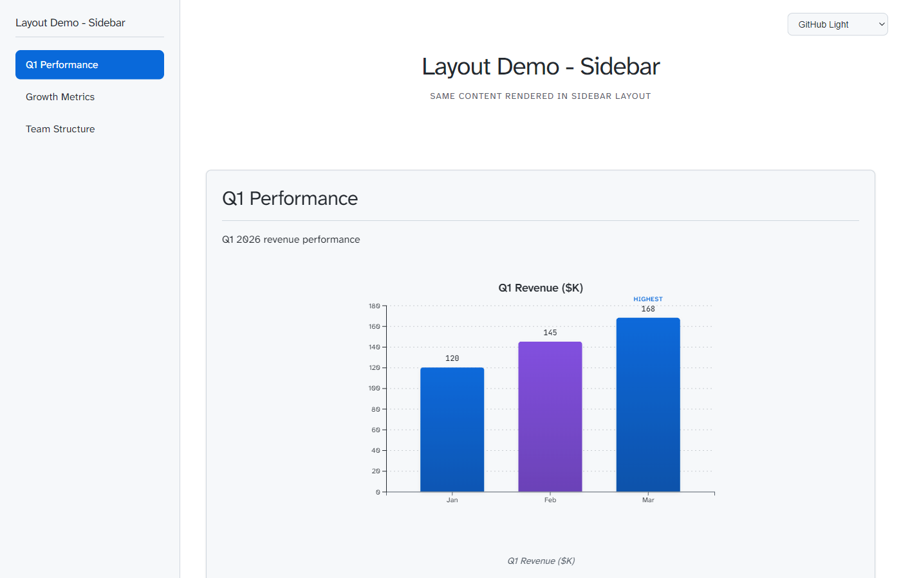
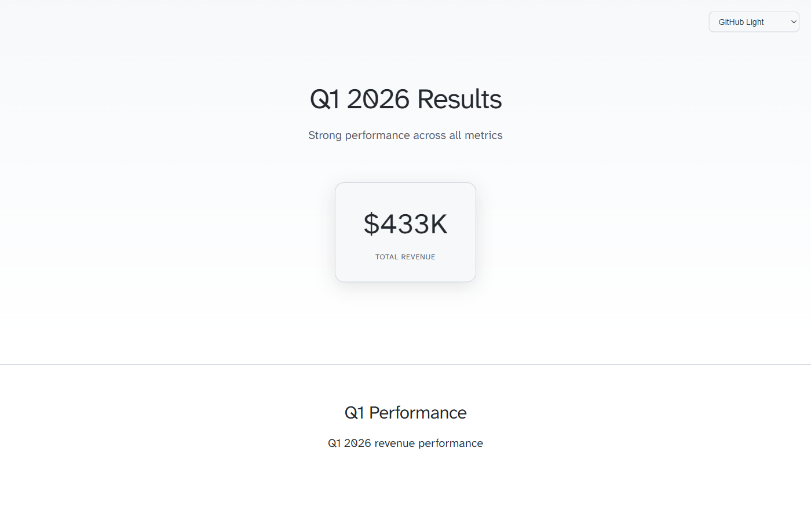
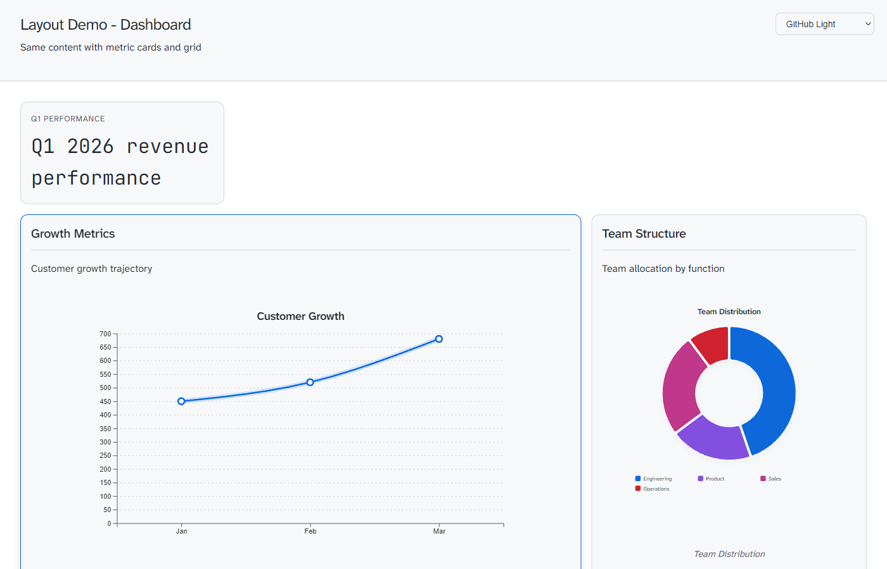
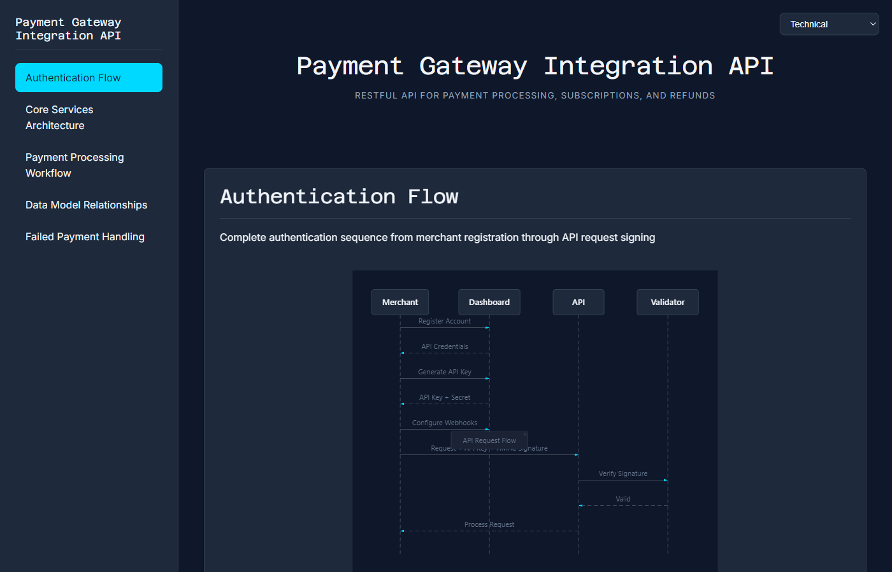
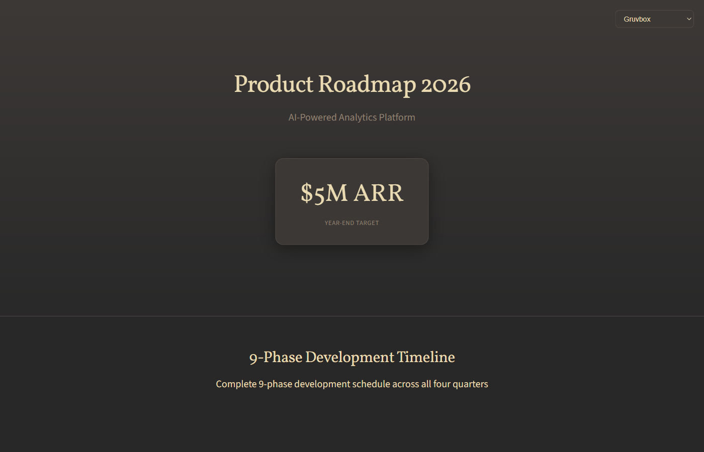
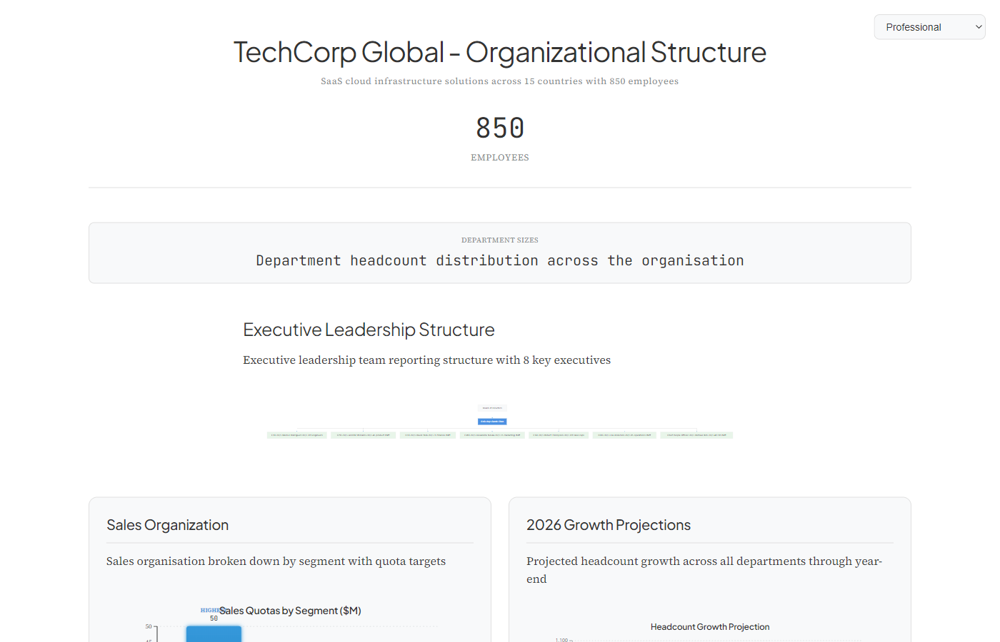

# thought_bubble Examples

Visual gallery of generated output. Every file is self-contained HTML that works offline.

---

## Complete Chart Library

[](all_d3_charts.html)

16 D3 chart types with annotations, emphasis effects, curve interpolation, and colour strategies. Dashboard layout with GitHub Light theme.

[Explore all charts →](all_d3_charts.html)

---

## Layout Showcase

### Sidebar Navigation

[](layout_sidebar.html)

Fixed navigation for multi-section docs. Best for: API references, technical documentation, user guides.

### Magazine Editorial

[](layout_magazine.html)

Hero section with pull quotes and narrative flow. Best for: case studies, reports, product launches.

### Dashboard Monitoring

[](layout_dashboard.html)

Metric cards with responsive chart grid. Best for: KPIs, performance monitoring, analytics.

---

## Full Documentation Examples

### Payment Gateway API

[](payment_gateway_integration.html)

RESTful API documentation with sequence diagrams, flowcharts, and ER models. 

**Sidebar layout** | **Technical theme** | **5 diagrams**

### Product Roadmap 2026

[](product_roadmap_2026.html)

9-phase development plan with gantt timeline, donut charts, and annotated area graphs.

**Magazine layout with hero** | **Gruvbox theme** | **$5M ARR target**

### Enterprise Org Structure

[](techcorp_org_structure.html)

850-person organization with department breakdowns, flowcharts, and growth metrics.

**Dossier layout** | **Professional theme** | **8 departments**

---

## Legacy Examples

Additional examples from earlier versions:

- [System Architecture](system_architecture_example.html) - Microservices with interactive diagrams
- [Team Framework](Team_Framework_Visualization_example.html) - Operational framework with metrics
- [E-Commerce Platform](ecommerce_platform_visualization.html) - Service integration flows
- [Learning Journey](learning_path_example.html) - Timeline with weekly milestones
- [Pattern-Rule Integration](pattern_rule_integration_example.html)
- [Travel Itinerary](travel_itinerary_example.html)

---

## Themes

All examples include live theme switchers. Available themes:

**Dark**: Tokyo Night, Dracula, Gruvbox, Solarized Dark, GitHub Dark, Technical, Dark  
**Light**: Solarized Light, GitHub Light, Professional, Minimal, Creative

---

## Generate Your Own

```
"Use thought-bubble to analyze and visualize this documentation."
```

Attach your content and the AI handles analysis, diagram generation, and HTML creation.
