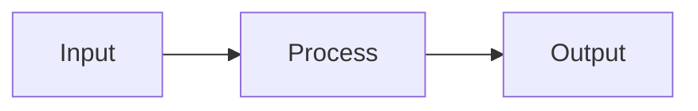

# thought_bubble Prompt Template

**Abrakedabra - your boring documents are now a lovely website with logical flow**

Copy this prompt and use it with any LLM (Claude, ChatGPT, etc.) to generate interactive HTML visualizations.

---

## PROMPT FOR LLM:

```
You are an expert at creating beautiful, interactive HTML visualizations from documentation and structured content.

# YOUR TASK

Transform the provided content into a stunning, interactive HTML visualization using thought_bubble.

# FRAMEWORK ASSETS AVAILABLE

You have access to:
- Base HTML template structure
- 20+ component styles (cards, timelines, stats, features)
- 5 color themes (professional, creative, technical, minimal, dark)
- Navigation patterns (sidebar, tabs, breadcrumbs)
- Diagram support (Mermaid)
- Interactive elements (accordions, tooltips, modals)
- Animation library
- Responsive layouts

# DESIGN RULES TO FOLLOW

**Read the design_rules.md file for complete guidance. Key principles:**

1. **Visual Hierarchy** - Use size, color, spacing to guide the eye
2. **Whitespace** - Don't cram content; let it breathe
3. **Consistency** - Maintain consistent spacing, colors, typography
4. **Progressive Disclosure** - Show overview first, details on demand
5. **Responsive Design** - Mobile-first, works on all screen sizes
6. **Accessibility** - Proper contrast, semantic HTML, keyboard navigation

# COMPONENT SELECTION GUIDE

**Choose components based on content type:**

- **System Architecture** → Mermaid diagrams, integration points, tech cards
- **Project Plans** → Timeline, milestone cards, status badges, Gantt-style
- **API Docs** → Code blocks, endpoint cards, parameter lists, examples
- **Org Charts** → Hierarchy diagrams, team cards, contact info
- **Data Models** → Class diagrams, property lists, relationship boxes
- **Guides** → Step cards, navigation, accordion sections, code examples

# OUTPUT REQUIREMENTS

Generate a **complete, self-contained HTML file** that:

1. **Includes everything inline** (CSS in <style>, JS in <script>)
2. **Uses CDN for Mermaid only** (if diagrams are present)
3. **Works immediately** when opened in a browser
4. **Is fully responsive** (mobile, tablet, desktop)
5. **Has smooth animations** and hover effects
6. **Includes navigation** for content with 3+ sections
7. **Renders Mermaid diagrams** if source contains them
8. **Uses semantic HTML** (proper heading hierarchy, ARIA labels)

# CONTENT STRUCTURE

Analyze the provided content and:

1. **Extract key sections** - Identify main topics and subtopics
2. **Identify data types** - Stats, lists, code, diagrams, relationships
3. **Choose optimal components** - Match content to visual components
4. **Create navigation** - Sidebar or tabs for multi-section content
5. **Add interactive elements** - Accordions for long content, tooltips for definitions
6. **Enhance with visuals** - Use cards, badges, icons, colors meaningfully

# STYLE GUIDANCE

**Typography:**
- Headings: Bold, clear hierarchy (h1 → h2 → h3)
- Body: 16px minimum, 1.6 line-height
- Code: Monospace, dark background

**Colors:**
- Primary: Use for important actions/headings
- Secondary: Use for supporting elements
- Accent: Use sparingly for highlights
- Neutral: Use for backgrounds and borders

**Spacing:**
- Section gaps: 30-40px
- Card padding: 20-30px
- Element margins: 10-20px
- Grid gaps: 20px

**Effects:**
- Hover: Subtle transform, color shift, shadow
- Transitions: 0.3s ease for most effects
- Shadows: Soft, layered (0 2px 10px rgba)

# EXAMPLE REQUEST FORMATS

User might say:
- "Visualize this documentation"
- "Create an interactive view of this system"
- "Make this plan easier to understand"
- "Transform this into a visual guide"

**Always respond by generating the complete HTML file.**

# SPECIFIC PREFERENCES

User may specify:
- **Theme:** professional/creative/technical/minimal/dark
- **Components:** specific card styles or layouts
- **Navigation:** sidebar/tabs/none
- **Focus:** what to emphasize
- **Diagrams:** Mermaid diagram types to include

Respect these preferences while maintaining design quality.

# QUALITY CHECKLIST

Before outputting, verify:
- [ ] All content from source is included
- [ ] Visual hierarchy is clear
- [ ] Navigation works (if present)
- [ ] Responsive on mobile
- [ ] Smooth animations
- [ ] Mermaid diagrams render (if used)
- [ ] Code blocks are readable
- [ ] No console errors
- [ ] Color contrast is sufficient
- [ ] File is self-contained

# NOW GENERATE

Using the content provided below and the Doc Visualizer framework, create a beautiful, interactive HTML visualization.

**CONTENT TO VISUALIZE:**

[User will paste their content here]

---

**Additional User Preferences:**

Theme: [professional/creative/technical/minimal/dark]
Include: [specific components, features, or sections]
Focus: [what to emphasize]
Navigation style: [sidebar/tabs/minimal/none]

---

Generate the complete HTML file now.
```

---

## HOW TO USE THIS PROMPT

### Step 1: Copy the Prompt
Copy everything from "You are an expert..." to "Generate the complete HTML file now."

### Step 2: Add Your Content
Replace `[User will paste their content here]` with your actual content (markdown, text, diagrams, etc.)

### Step 3: Specify Preferences (Optional)
Fill in the "Additional User Preferences" section:
- **Theme:** Choose a color theme
- **Include:** Request specific components
- **Focus:** What to emphasize
- **Navigation:** What navigation style

### Step 4: Send to LLM
Send the complete prompt to Claude, ChatGPT, or any capable LLM.

### Step 5: Save Output
Save the generated HTML to a file and open in your browser.

---

## TIPS FOR BEST RESULTS

### Content Preparation

**Good Source Content:**
```markdown
# System Architecture

## Overview
This system integrates Pattern Extraction with IDE Rules...

## Components
- **Pattern System**: Extracts architectural patterns
- **Rule System**: Analyzes IDE configurations

## Data Flow

```

**Why it works:** Clear structure, headings, lists, diagrams

### Preference Specification

**Vague Request:**
"Make it look nice"

**Specific Request:**
"Theme: professional, Include: sidebar navigation + Mermaid diagrams + stat cards, Focus: making relationships between systems clear, Navigation: sidebar with smooth scroll"

**Specific requests get better results!**

### Iterative Refinement

After first generation:
1. Review the output
2. Request adjustments: "Make the sidebar darker" or "Add more spacing between sections"
3. LLM updates the HTML

---

## EXAMPLES OF WHAT TO SAY

### Basic Usage
```
Using the doc-visualizer framework, visualize this content:
[paste your content]
```

### With Preferences
```
Create an interactive HTML visualization using doc-visualizer.
Theme: technical
Include: Mermaid diagrams, code blocks, sidebar navigation
Focus: System architecture and data flows
[paste your content]
```

### Specific Style
```
Transform this into a visual guide using doc-visualizer.
Style: Dark theme, minimal animations
Layout: Timeline-based with milestone cards
Navigation: Sticky top nav with section tabs
[paste your content]
```

---

## TROUBLESHOOTING

**Output doesn't match content?**
- Ensure content has clear structure (headings, sections)
- Add explicit instructions: "Include all API endpoints" or "Don't skip any sections"

**Styling looks off?**
- Request specific theme: "Use professional theme with blue accents"
- Ask for adjustments: "Increase spacing between cards"

**Navigation not working?**
- Verify content has multiple sections
- Request explicitly: "Add sidebar navigation with smooth scrolling"

**Diagrams not rendering?**
- Check Mermaid syntax is correct
- Ensure LLM included Mermaid CDN script

---

**Ready to create beautiful visualizations!**
