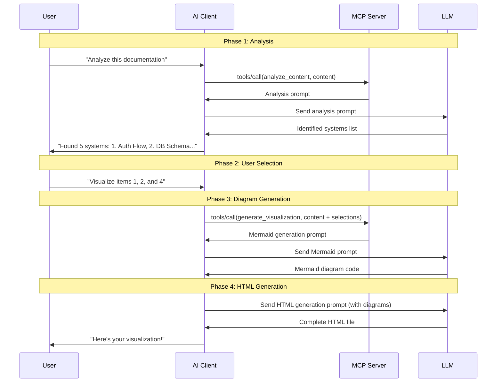

# Architecture Documentation

## System Overview

```
┌─────────────────────────────────────────────────────────────────┐
│                         AI Client                                │
│                   (Claude, ChatGPT, Cursor)                      │
└────────────┬────────────────────────────────────────────────────┘
             │ JSON-RPC over STDIO
             │
┌────────────▼────────────────────────────────────────────────────┐
│                    thought_bubble MCP Server                     │
│  ┌──────────────────────────────────────────────────────────┐  │
│  │                      Server Core                          │  │
│  │  - STDIO Transport                                        │  │
│  │  - JSON-RPC Handler                                       │  │
│  │  - Tool Registry                                          │  │
│  └──────────────────────────────────────────────────────────┘  │
│                                                                  │
│  ┌─────────────────────┐      ┌─────────────────────────────┐ │
│  │  Tool 1:            │      │  Tool 2:                    │ │
│  │  analyze_content    │      │  generate_visualization     │ │
│  │                     │      │                             │ │
│  │  Input: content     │      │  Input: content +           │ │
│  │  Output: analysis   │      │          selected systems   │ │
│  │          prompt     │      │  Output: mermaid +          │ │
│  │                     │      │          HTML prompts       │ │
│  └─────────────────────┘      └─────────────────────────────┘ │
│                                                                  │
│  ┌──────────────────────────────────────────────────────────┐  │
│  │                   Prompt Templates                        │  │
│  │  - Analysis prompt                                        │  │
│  │  - Mermaid generation prompt                              │  │
│  │  - HTML generation prompt                                 │  │
│  └──────────────────────────────────────────────────────────┘  │
└──────────────────────────────────────────────────────────────────┘
             │
             │ Returns prompts
             │
┌────────────▼────────────────────────────────────────────────────┐
│                            LLM                                   │
│              (Claude, GPT-4, etc. via AI Client)                 │
│                                                                  │
│  - Analyzes content                                              │
│  - Identifies systems                                            │
│  - Generates Mermaid diagrams                                    │
│  - Generates HTML visualization                                  │
└──────────────────────────────────────────────────────────────────┘
```

## Communication Flow

### Message Format (JSON-RPC 2.0)

**Tool Call Request**:
```json
{
  "jsonrpc": "2.0",
  "id": 1,
  "method": "tools/call",
  "params": {
    "name": "analyze_content",
    "arguments": {
      "content": "# Documentation here..."
    }
  }
}
```

**Tool Call Response**:
```json
{
  "jsonrpc": "2.0",
  "id": 1,
  "result": {
    "content": [
      {
        "type": "text",
        "text": "ANALYSIS PROMPT FOR LLM:\n\n..."
      }
    ]
  }
}
```

## Workflow Sequence



## Component Architecture

### Server Core (`src/index.ts`)

```typescript
┌─────────────────────────────────────┐
│         Server Instance             │
│  - Name: thought-bubble-mcp-server  │
│  - Version: 0.1.0                   │
│  - Capabilities: { tools: {} }      │
└─────────────────────────────────────┘
              │
              ├─► ListToolsRequestHandler
              │   └─► Returns tool schemas
              │
              └─► CallToolRequestHandler
                  ├─► Route to analyze_content
                  └─► Route to generate_visualization
```

### Tool 1: analyze_content (`src/tools/analyze_content.ts`)

```
Input Validation (Zod)
         │
         ▼
Template Selection (ANALYSIS_PROMPT)
         │
         ▼
Content Injection
         │
         ▼
Return Prompt String
```

### Tool 2: generate_visualization (`src/tools/generate_visualization.ts`)

```
Input Validation (Zod)
         │
         ├─► selectedSystems array
         ├─► theme (optional)
         └─► navigationStyle (optional)
         │
         ▼
Step 1: Mermaid Generation Prompt
         │
         ├─► Format selected items
         ├─► Inject into template
         └─► Return prompt
         │
         ▼
Step 2: HTML Generation Instructions
         │
         └─► Provide assembly instructions
```

## Data Flow

### Analyze Content Flow

```
User Content
     │
     ├─► Schema Validation (Zod)
     │
     ├─► Escape/Sanitize
     │
     ├─► Inject into Template
     │         │
     │         └─► ANALYSIS_PROMPT
     │                   │
     │                   ├─► Look for WORKFLOWS
     │                   ├─► Look for SYSTEMS
     │                   ├─► Look for DATA_MODELS
     │                   └─► Look for RELATIONSHIPS
     │
     └─► Return to AI Client
              │
              └─► AI sends to LLM
                       │
                       └─► LLM analyzes and returns structured list
```

### Generate Visualization Flow

```
Content + Selected Systems
     │
     ├─► Schema Validation
     │         │
     │         ├─► id: number
     │         ├─► title: string
     │         ├─► description: string
     │         └─► diagramType: enum
     │
     ├─► Step 1: Mermaid Prompt
     │         │
     │         ├─► Format selections
     │         ├─► Inject diagram types
     │         └─► Return prompt
     │                  │
     │                  └─► AI → LLM → Mermaid code
     │
     └─► Step 2: HTML Prompt
               │
               ├─► Include Mermaid diagrams
               ├─► Apply theme
               ├─► Set navigation style
               └─► Return prompt
                        │
                        └─► AI → LLM → Complete HTML
```

## File Structure & Dependencies

```
thought_bubble_mcp/
│
├── src/
│   ├── index.ts                    # Main entry point
│   │   └── Imports:
│   │       ├── @modelcontextprotocol/sdk
│   │       ├── tools/analyze_content
│   │       └── tools/generate_visualization
│   │
│   ├── types.ts                    # Type definitions
│   │   └── Exports:
│   │       ├── IdentifiedItem
│   │       ├── AnalysisResult
│   │       ├── SelectedSystem
│   │       └── VisualizationResult
│   │
│   ├── prompts/
│   │   └── templates.ts            # Prompt templates
│   │       └── Exports:
│   │           ├── ANALYSIS_PROMPT
│   │           ├── MERMAID_GENERATION_PROMPT
│   │           ├── buildVisualizationPrompt()
│   │           └── formatAnalysisForUser()
│   │
│   └── tools/
│       ├── analyze_content.ts      # Tool 1 implementation
│       │   └── Exports:
│       │       ├── analyzeContentSchema
│       │       ├── analyzeContent()
│       │       └── parseAnalysisResponse()
│       │
│       └── generate_visualization.ts # Tool 2 implementation
│           └── Exports:
│               ├── generateVisualizationSchema
│               ├── generateVisualization()
│               ├── buildFinalPrompt()
│               └── parseMermaidResponse()
│
├── dist/                           # Compiled JavaScript (generated)
│   └── index.js                    # Entry point for execution
│
└── Configuration files
    ├── package.json                # NPM configuration
    ├── tsconfig.json               # TypeScript configuration
    ├── .gitignore                  # Git exclusions
    └── .npmignore                  # NPM exclusions
```

## Error Handling Strategy

```
Tool Call Request
     │
     ├─► Unknown tool name
     │   └─► McpError: MethodNotFound
     │
     ├─► Invalid parameters
     │   └─► Zod validation fails
     │       └─► McpError: InvalidParams
     │
     ├─► Missing required fields
     │   └─► Zod validation fails
     │       └─► McpError: InvalidParams
     │
     └─► Success
         └─► Return formatted response
```

## Security Considerations

### Input Validation
- All tool inputs validated with Zod schemas
- Content sanitized before template injection
- No execution of user-provided code

### Output Safety
- Generated prompts are text-only
- No sensitive data stored server-side
- Stateless design (no session persistence)

### Transport Security
- STDIO transport (local only by default)
- No network exposure
- Runs with user's permissions

## Performance Characteristics

### Server Startup
```
Initialize Server      : ~100ms
Register Handlers      : ~10ms
Connect STDIO          : ~50ms
Total Startup Time     : ~160ms
```

### Tool Call Latency
```
Input Validation       : <5ms
Template Processing    : <10ms
String Operations      : <5ms
Response Formatting    : <5ms
Total Tool Call Time   : <25ms
```

### Memory Usage
```
Base Node.js Process   : ~30MB
MCP SDK                : ~10MB
Tool Code              : ~5MB
Template Strings       : ~2MB
Total Memory           : ~50MB
```

## Integration Points

### With AI Clients
- **Claude Desktop**: Via `claude_desktop_config.json`
- **Cursor**: Via `.cursor/mcp.json`
- **Custom clients**: Via MCP SDK

### With LLMs
- **Claude**: Best for complex analysis
- **GPT-4**: Excellent diagram generation
- **Local models**: May struggle with nuanced analysis

### With thought_bubble Framework
- References design principles
- Uses component patterns
- Generates compatible HTML
- Maintains visual consistency

## Deployment Options

### Option 1: Local Development
```bash
node /absolute/path/to/dist/index.js
```

### Option 2: Global NPM Install
```bash
npm install -g @thought-bubble/mcp-server
thought-bubble-mcp
```

### Option 3: NPX (No Install)
```bash
npx @thought-bubble/mcp-server
```

### Option 4: Docker (Future)
```bash
docker run -i thought-bubble-mcp
```

## Monitoring & Debugging

### Logging
- Server logs to `stderr` (stdout reserved for MCP protocol)
- AI clients typically log to app-specific locations
- Use `console.error()` for debugging

### Testing
```bash
# Build
npm run build

# Test server starts
node dist/index.js

# Check MCP client logs
tail -f ~/.config/Claude/logs/mcp*.log
```

---

## Architecture Principles

1. **Simplicity**: STDIO transport, stateless design
2. **Modularity**: Clear separation between tools and prompts
3. **Extensibility**: Easy to add new tools or modify prompts
4. **Type Safety**: Full TypeScript coverage
5. **Standards Compliance**: Follows MCP specification precisely

**The architecture is designed for reliability, maintainability, and ease of use.**
