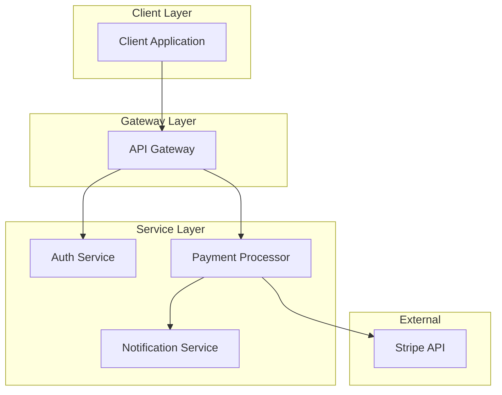
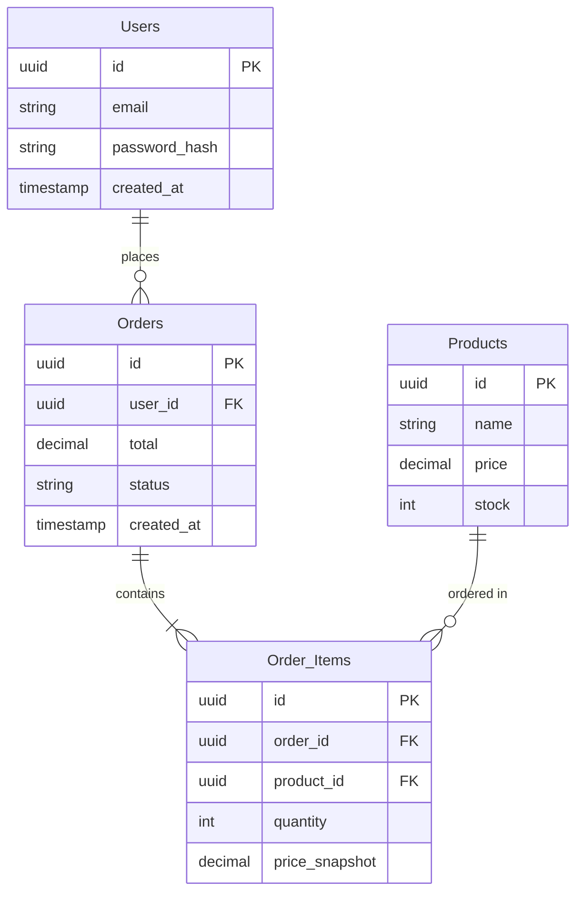

# Example Usage

A complete walkthrough of using the thought_bubble MCP server.

## Example 1: Simple System Architecture

### Input Content

```markdown
# Payment Gateway System

## Architecture
- API Gateway: Entry point for all requests
- Auth Service: Handles JWT token validation
- Payment Processor: Integrates with Stripe API
- Notification Service: Sends email confirmations

## Payment Flow
1. Client sends payment request to API Gateway
2. API Gateway validates JWT token with Auth Service
3. Auth Service returns user information
4. API Gateway forwards to Payment Processor
5. Payment Processor charges via Stripe
6. Payment Processor notifies Notification Service
7. Notification Service sends confirmation email
```

### Step 1: AI Calls `analyze_content`

```json
{
  "content": "<the content above>"
}
```

**Server Response:**
```
ANALYSIS PROMPT FOR LLM:

Analyze the following content and identify visualization opportunities.

Look for:
1. **WORKFLOWS** - Processes, flows, or sequences
2. **SYSTEMS** - Architectures, services, or system components
3. **DATA MODELS** - Entities, objects, or data structures
4. **RELATIONSHIPS** - Connections, integrations, or dependencies

...
```

### Step 2: LLM Analyzes and Returns

```
I've identified these visualization opportunities:

WORKFLOWS:
1. Payment Processing Flow - Client request through API Gateway to payment confirmation

SYSTEMS:
2. Microservices Architecture - API Gateway, Auth Service, Payment Processor, Notification Service

RELATIONSHIPS:
3. Service Dependencies - How each service connects and communicates

Which items would you like me to create visualizations for?
Respond with the numbers (e.g., '1, 3, 5' or '1-4, 7')
```

### Step 3: User Selects Items

```
Let's visualize 1 and 2
```

### Step 4: AI Calls `generate_visualization`

```json
{
  "content": "<original content>",
  "selectedSystems": [
    {
      "id": 1,
      "title": "Payment Processing Flow",
      "description": "Client request through API Gateway to payment confirmation",
      "diagramType": "sequence"
    },
    {
      "id": 2,
      "title": "Microservices Architecture",
      "description": "API Gateway, Auth Service, Payment Processor, Notification Service",
      "diagramType": "c4"
    }
  ],
  "theme": "professional",
  "navigationStyle": "sidebar"
}
```

**Server Response:**
```
STEP 1: GENERATE MERMAID DIAGRAMS

Send this prompt to your LLM to generate Mermaid diagram code:

---
Generate Mermaid diagram code for the selected items.

For each selected item, choose the most appropriate diagram type:
...
---

STEP 2: GENERATE FINAL HTML
...
```

### Step 5: LLM Generates Mermaid Diagrams

```mermaid
### Diagram for Item 1
```mermaid
sequenceDiagram
    participant Client
    participant APIGateway as API Gateway
    participant Auth as Auth Service
    participant Payment as Payment Processor
    participant Notification as Notification Service
    participant Stripe

    Client->>APIGateway: Payment Request + JWT
    APIGateway->>Auth: Validate Token
    Auth-->>APIGateway: User Info
    APIGateway->>Payment: Process Payment
    Payment->>Stripe: Charge Card
    Stripe-->>Payment: Success
    Payment->>Notification: Send Confirmation
    Notification-->>Client: Email Sent
```

### Diagram for Item 2

```

### Step 6: LLM Generates Final HTML

The server returns a complete HTML file with:
- Responsive sidebar navigation
- Professional theme styling
- Embedded Mermaid diagrams
- Smooth scroll behavior
- Mobile-friendly layout

## Example 2: API Documentation

### Input

```markdown
# User Management API

## Endpoints

### POST /api/users/register
Create a new user account

Parameters:
- email (string, required)
- password (string, required)
- name (string, optional)

Response:
- 201: User created
- 400: Validation error
- 409: Email already exists

### GET /api/users/:id
Retrieve user information

### User Schema
{
  "id": "uuid",
  "email": "string",
  "name": "string",
  "created_at": "timestamp",
  "role": "enum: user|admin"
}
```

### Suggested Selections

1. User Registration Flow → `flowchart`
2. API Endpoints Overview → `flowchart`
3. User Schema → `class`

## Example 3: Database Design

### Input

```markdown
# E-commerce Database

## Tables

### Users
- id (PK)
- email (unique)
- password_hash
- created_at

### Products
- id (PK)
- name
- price
- stock
- category_id (FK)

### Orders
- id (PK)
- user_id (FK)
- total
- status
- created_at

### Order_Items
- id (PK)
- order_id (FK)
- product_id (FK)
- quantity
- price_snapshot
```

### Suggested Selections

1. Database Schema → `er` (Entity-Relationship)
2. Order Creation Process → `sequence`

### Expected ER Diagram



## Theme Examples

### Professional Theme
- Clean white background
- Blue accents (#2563eb)
- Subtle shadows
- Corporate typography

### Dark Theme
- Dark grey background (#1e293b)
- Bright accent colours
- High contrast
- Easy on eyes

### Technical Theme
- Monospace fonts
- Terminal-inspired colours
- Code-focused layout
- Developer-friendly

## Navigation Examples

### Sidebar (Recommended for 5+ sections)
```
┌──────────────────┬────────────────────────────┐
│ Overview         │                            │
│ Architecture     │   Main Content Area        │
│ API Reference    │                            │
│ Database Schema  │   Scrollable content       │
│ Workflows        │                            │
└──────────────────┴────────────────────────────┘
```

### Tabs
```
┌──────────────────────────────────────────────┐
│ Overview | Architecture | API | Database     │
├──────────────────────────────────────────────┤
│                                              │
│           Active Tab Content                 │
│                                              │
└──────────────────────────────────────────────┘
```

### Minimal
```
┌──────────────────────────────────────────────┐
│  [Overview] [Architecture] [API] [Database]  │
├──────────────────────────────────────────────┤
│                                              │
│          Scrolling Long-form Content         │
│                                              │
└──────────────────────────────────────────────┘
```

---

**These examples show the flexibility and power of the thought_bubble MCP server!**
