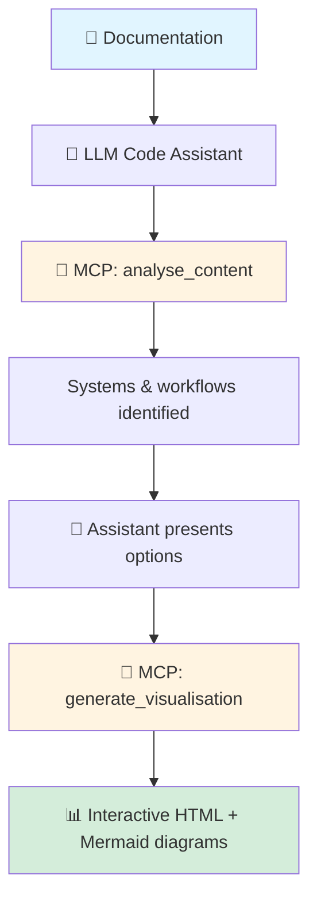

# thought_bubble Workflow Diagram

Working file to iterate on the "How It Works" diagram for the README.

## Process Description
- Thought_bubble MCP server loaded upon session start
- User adds documentation to LLM context 
- User asks "Use thought-bubble to analyse and visualise this documentation"
- LLM calls MCP analyse_content tool
- MCP analyses content and identifies systems, workflows, data models
- LLM presents options to user
- User selects which items to visualise
- LLM calls MCP generate_visualisation tool with selected items
- MCP generates Mermaid diagrams and complete HTML visualisation
- User opens HTML file in browser

## Elements:
- Document(s)
- LLM code-assistant
- MCP (thought_bubble)
- User (optional)

## Draft Flowchart:

## Notes:
- Shows the flow without user interactions
- Focuses on the technical components
- Simple and clean
- Can be refined
